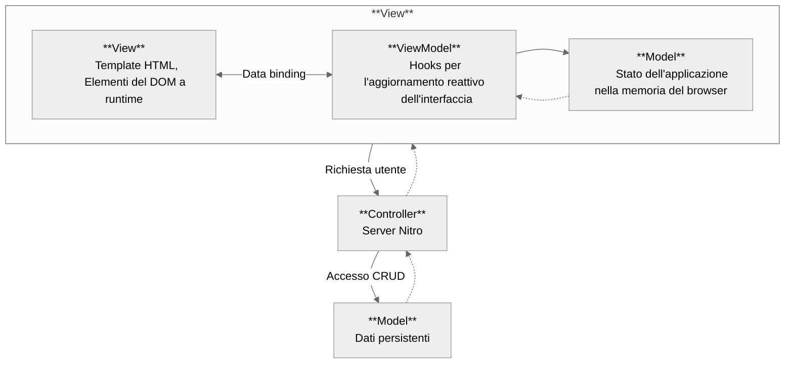
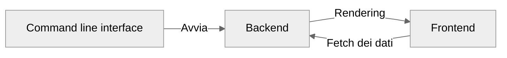
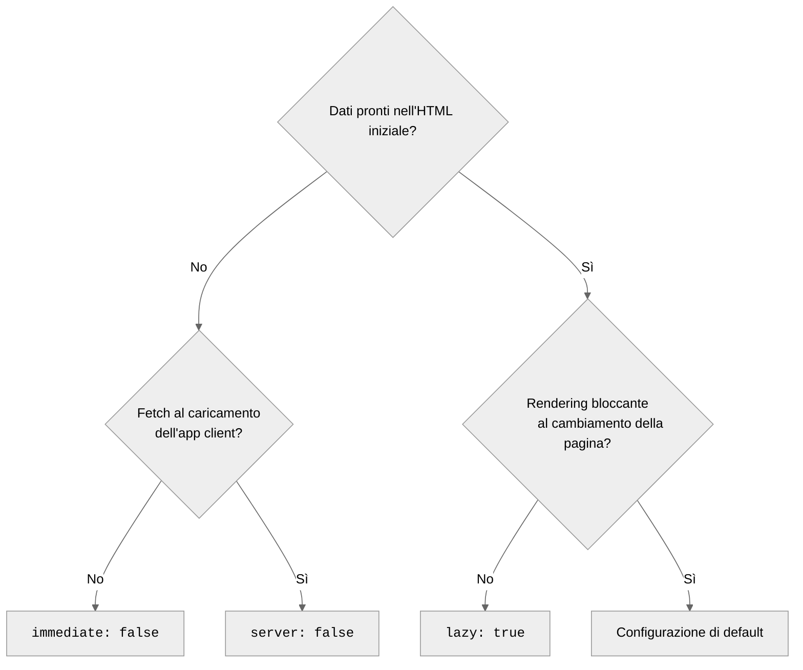
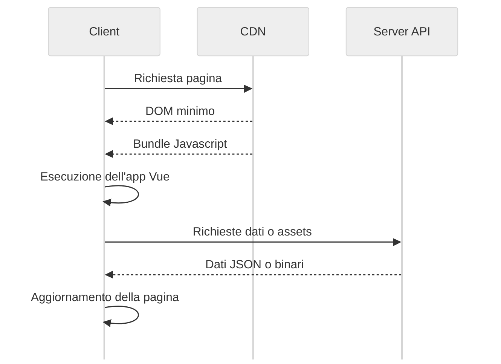
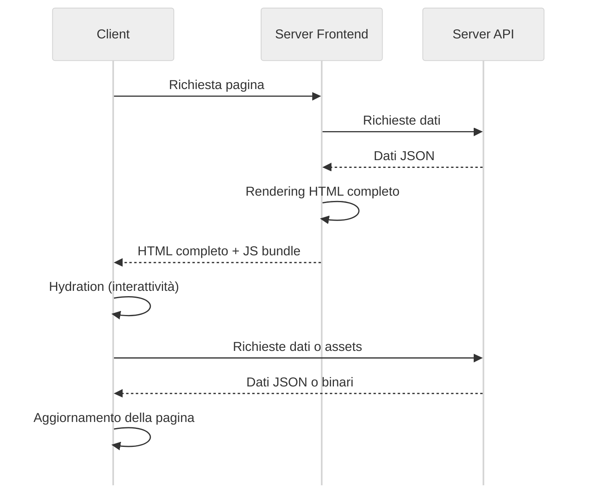
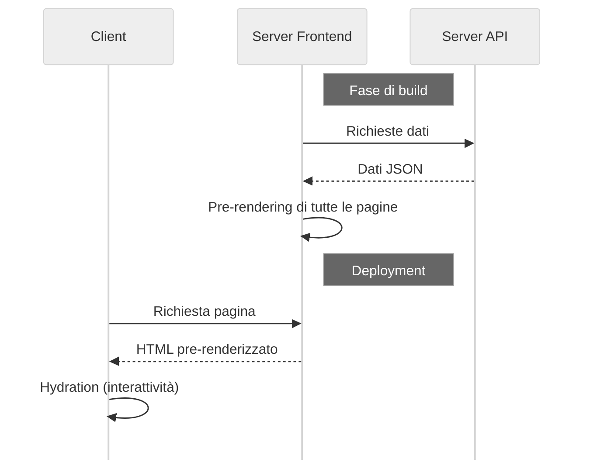
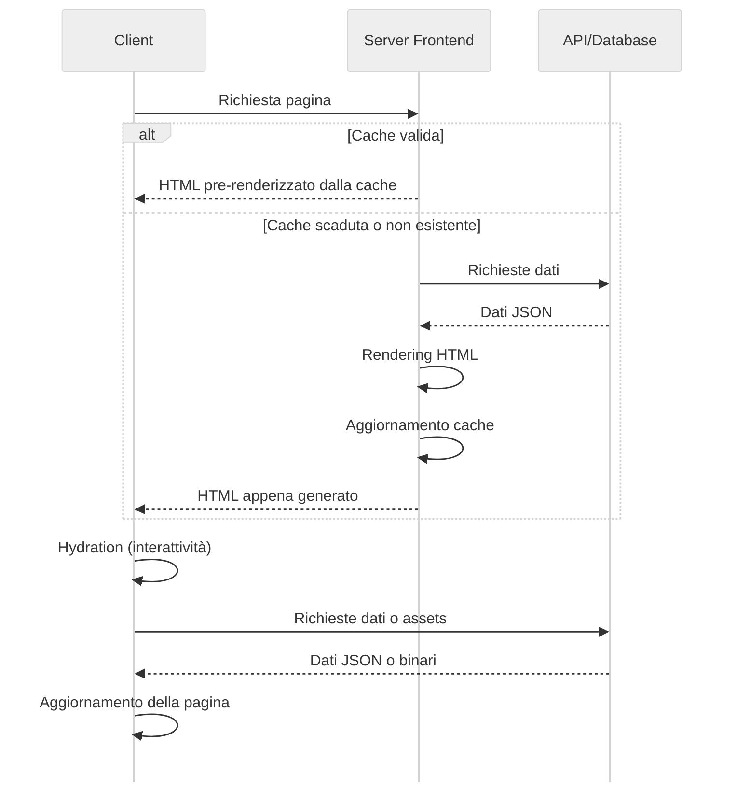
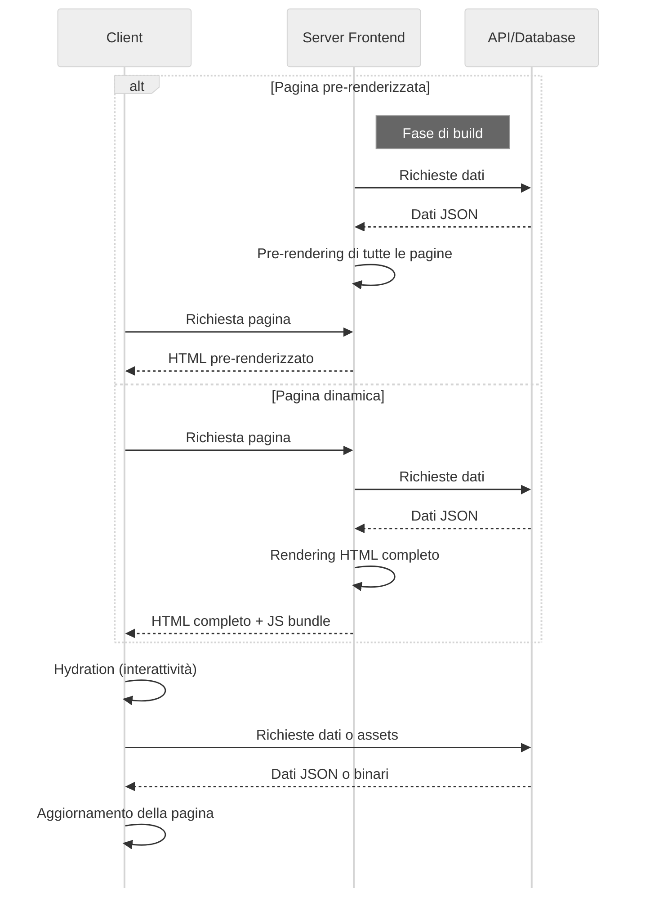

## Nuxt

Nuxt è un framework per applicazioni web, avviato come progetto Open source da Alexandre e Sebastien Chopin e Pooya Parsa nel 2016, che continua ad essere mantenuto attivamente su Github da un team di sviluppatori che accettano contributi, all'indirizzo [github.com/nuxt/nuxt](https://github.com/nuxt/nuxt).

Nuxt si propone di risolvere i problemi di performance, di ottimizzazione e di accessibilità delle applicazioni basate su componenti con il suo sistema di frontend, ma anche di fornire un ambiente di sviluppo flessibile, per facilitare la scalabilità e la manutenibilità del codice backend. Si possono infatti realizzare applicazioni **fullstack** secondo il pattern MVC, in cui la view è implementata con Vue ed il controller con _Nitro_, un server http fatto su misura per Nuxt.



> L'architettura generale di una applicazione Nuxt. Si noti che la View adotta a sua volta il pattern _MVVM_ quindi si hanno due modelli dei dati con interfacce potenzialmente distinte. Infatti nel modo tradizionale di usare Vue, backend e frontend potrebbero essere viste come due applicazioni a bassa coesione (basti pensare a come potrebbero essere realizzate in due linguaggi di programmazione differenti) ed alto accoppiamento (nel senso che un cambiamento da un lato potrebbe richiedere un altro cambiamento dall'altro lato del sistema, per mantenere la coerenza). Nuxt si occupa appunto di gestire la **comunicazione tra i due models**: il model dei dati persistenti ed il model dell'applicazione che esegue nel browser, in modo da ottenere _loose coupling_ e _high cohesion_.

Lo slogan di Nuxt è "The Intuitive Vue Framework", che è in accordo con il suo obiettivo di semplificare la creazione di applicazioni web fornendo un'infrastruttura preconfigurata e pronta all'uso. In questo modo lo sviluppatore può concentrarsi da subito sulla logica dell'applicazione, piuttosto che sulla configurazione del progetto. È quindi ricalcato il punto di vista di David Heinemeier Hansson su Rails, il framework per applicazioni web per Ruby che ideò nel luglio 2004, per il quale sosteneva il principio "convention over configuration"[^convention-over-configuration].

Nonostante questo, Nuxt utilizza internamente tecnologie raffinate, come Typescript e Vite, che consentono di scrivere codice robusto. Con Nuxt si possono realizzare applicazioni di vario genere, come siti vetrina, blog, documentazioni o wiki, e-commerce, dashboard gestionali, piattaforme di social networking, applicazioni mobile-first, etc...

La repository di sviluppo di Nuxt è organizzata secondo il modello di _monorepo_, quindi include pacchetti funzionanti in maniera disaccoppiata, ma che sono usati tutti in maniera coesa all'interno del sistema Nuxt. La versione corrente è la **3.15**, rilasciata nel dicembre 2024. La struttura del monorepo è la seguente:

-   `packages/nuxt` è il core del framework.
-   `packages/nuxi` è lo strumento da linea di comando per la creazione di nuovi progetti, ora spostato su [github.com/nuxt/cli](github.com/nuxt/cli).
-   `packages/schema` contiene le definizioni dei tipi di dati utilizzati.
-   `packages/kit` è un toolkit per la creazione di moduli aggiuntivi.
-   `packages/test-utils` contiene degli script per il testing di unità.
-   `packages/vite` è una fork di Vite, un bundler per gli script di frontend, usato di default da Nuxt.
-   `packages/webpack` è una fork di Webpack, un'altro bundler per gli script di frontend che si può scegliere in alternativa a Vite.
-   `docs` è la documentazione ufficiale, scritta sotto forma di sito web statico, usando Nuxt stesso.

Oltre a modificare la monorepo, gli sviluppatori Open source sono invitati a creare moduli per estendere le Nuxt con funzionalità non essenziali, ma idonee per l'interoperabilità con altri software. Questi moduli possono essere pubblicati su Npm come pacchetti, con `@nuxt/kit` come dipendenza, ed al Marzo 2025 se ne contano più di 200[^moduli-nuxt].

[^moduli-nuxt]: [Moduli supportati ufficialmente da Nuxt](https://nuxt.com/modules).

La versione vanilla di Nuxt propone un'intelaiatura che include una command line interface con cui si definisce il funzionamento del backend, che determina il modo in cui il frontend verrà mostrato agli utenti. Il frontend, a sua volta, è in comunicazione con il backend per ottenere dati aggiornati.

In questo schema sono mostrate queste parti e le loro interazioni:



[^convention-over-configuration]: [Wikipedia - Convention over configuration](https://en.wikipedia.org/wiki/Convention_over_configuration)

### Command line interface

L'ecosistema Nuxt fa uso di un programma invocabile da linea di comando chiamato _nuxi_. È installabile globalmente su un sistema provvisto di Node eseguendo `npm i -g @nuxt/cli`, e dispone di vari sotto-comandi per la gestione del progetto. È consigliato usare `npx nuxi <sotto-comando>` per evitare conflitti tra le versioni dei pacchetti installati localmente e globalmente: anteponendo "npx" si userà, se presente, la versione locale `node_modules/@nuxt/cli`.

#### `nuxi init <nome-progetto>`

È il comando per avviare un nuovo progetto nella directory `./<nome-progetto>`. Eseguendolo si dovrà scegliere il sistema di gestione dei pacchetti, che riguarderà il modo con il quale Nuxt ed anche gli agli altri pacchetti di terze parti saranno installati, e può essere tra:

-   **Npm**: Il classico package manager di Node, solitamente installato assieme ad esso scegliendo il pacchetto `node` nelle repository delle maggiori distribuzioni Linux, e disponibile di default nelle immagini Docker ufficiali di Node.
-   **Pnpm**: Un package manager alternativo a npm, progettato per migliorare le performance e ottimizzare l'utilizzo dello spazio su disco rispetto a npm, preferito per lo sviluppo locale.
-   **Yarn**: Un altro package manager alternativo a npm, sviluppato in Facebook nel 2016.
-   **Bun**: Con questa opzione si sceglie di usare una runtime diversa da Node: Bun, più efficiente in alcune operazioni di I/O, compatibile con le API Node e i suoi pacchetti di terze parti.
-   **Deno**: Un'altra runtime JavaScript che offre supporto nativo a Typescript, ma non è del tutto compatibile con alcuni pacchetti npm.

Subito dopo c'è la scelta **Initialize git repository**, che eseguirà `git init` se selezionata. Nella trattazione che segue adotteremo Npm come package manager e Git per il controllo di versione.

La directory `./nome-progetto` sarà indicata come `~`[^user-home], e conterrà i seguenti:

```bash
.git/				# Versioni dei file del progetto
.nuxt/				# Files temporanei usati dal server di sviluppo
.output/			# Files generati durante la build per la produzione
node_modules/		# Librerie di Nuxt e di terze parti
public/				# Risorse statiche da distribuire con l'applicazione
	robots.txt		# File di configurazione per i motori di ricerca
	favicon.ico		# Icona del sito
server/				# Directory preposta al codice riservato al server
	tsconfig.json	# Configurazione del compilatore Typescript per il backend
.gitignore			# Lista dei file da ignorare durante il versionamento
app.vue				# Entry point dell'applicazione
nuxt.config.ts		# File di configurazione di Nuxt
package-lock.json	# Albero delle versioni delle dipendenze
package.json		# Lista delle dipendenze e dei comandi di build
README.md			# Documentazione del progetto
tsconfig.json		# Configurazione del compilatore Typescript per il frontend
```

[^user-home]: Nel contesto di sistemi Unix-like, la tilde `~` è un alias per la directory home dell'utente corrente. Nei files di un'app Nuxt invece indica la directory radice del progetto.

#### `nuxi add`

Una volta inizializzato il progetto, questo è il comando per aggiungere funzionalità all'app. Prende come terzo argomento il tipo di template da aggiungere, che può essere tra:

-   **app**: Il componente Vue che fa da entry point dell'applicazione. È già presente di default in ogni progetto Nuxt, ma può essere sovrascritto con questo comando.
-   **page**: Una pagina web, che sarà accessibile alla rotta `/<nome-pagina>`.
-   **layout**: Un layout Vue, cioè un componente che definisce la struttura di una o più pagine. È un modo di riutilizzare il codice HTML e CSS in più parti dell'applicazione.
-   **component**: Un componente Vue, riutilizzabile in tutte le pagine o layout.
-   **error**: Un componente Vue che sarà mostrato in caso di errore.
-   **middleware**: Un middleware, cioè una funzione che può essere eseguita prima di caricare una pagina, lato server o lato client.
-   **composable**: Una funzione che può essere usata in uno o più componenti Vue. È un modo per riutilizzare la logica di business _stateful_ in più parti dell'applicazione.
-   **plugin**: Uno script typescript che viene eseguito prima di inizializzare l'applicazione Vue. Utile per l'inizializzazione di componenti software di terze parti. A differenza dei middleware, i plugin vengono eseguiti solo una volta, all'avvio dell'applicazione.
-   **api**: Un endpoint API, che sarà accessibile alla rotta `/api/<nome-endpoint>`. Utile per la comunicazione tra frontend e backend.
-   **server-route**: Un endpoint API, che sarà accessibile alla rotta `/<nome-endpoint>`.
-   **server-middleware**: Un middleware, simile a quelli di Express, che si interpone tra
-   **server-plugin**: Uno script typescript che viene eseguito prima di inizializzare il server Nitro. Utile per l'inizializzazione di componenti software di terze parti.
-   **server-util**: Un modulo typescript importato automaticamente in ogni file di tipo server.
-   **module**: Con questa opzione si crea un modulo Nuxt per sperimentarlo, e che potrà essere utilizzato anche in altri progetti.

Ogni aggiunta corrisponde ad un nuovo file che verrà creato nella directory corrispondente, provvisto di un _boilerplate_[^boilerplate], che sarà possibile modificare per adattarlo alle proprie esigenze.

[^boilerplate]: Cioè del codice ripetuto frequentemente.

#### `nuxi dev`

Una volta aggiunte le prime funzionalità si può lanciare il server di sviluppo, che permette di testare l'applicazione in locale. Di default il server è accessibile alla rotta `http://localhost:3000`, ma si può cambiare la porta con l'opzione `--port <numero-porta>`. Il server di sviluppo è dotato nativamente di _hot reloading_, cioè la capacità di ricaricare automaticamente la pagina web quando si salvano i file del progetto, in modo da velocizzare il feedback del sistema al programmatore.

#### `nuxi devtools`

Abilita o disabilita l'iniezione degli script Devtools nell'app Vue, quando è lanciata con `nuxi dev`. Sono un set di strumenti il debugging di applicazioni Nuxt, aggiuntivi a quelli già presenti nei browser moderni[^devtools].

Viene aggiunto un elemento html alla pagina, nel quale sono presenti diverse sezioni che mostrano informazioni di profilazione dell'app in sviluppo, tra cui:

-   **Pages**: Lista delle pagine dell'applicazione, con la possibilità di navigare tra di esse.
-   **Components**: Lista dei componenti Vue inseriti nel bundle, con riferimenti e dipendenze.
-   **Components tree**: Albero dei componenti Vue della pagina corrente. Fornisce una visualizzazione più ordinata rispetto ai devtools del browser.
-   **Imports**: Lista dei composables inseriti nel bundle.
-   **Modules**: Lista dei moduli utilizzati dall'applicazione, lato server o client.
-   **Assets**: Risorse statiche usate dall'applicazione, come immagini, font, icone, etc...
-   **Open Graph**: Metadati Open Graph[^open-graph] della pagina corrente, utili per la condivisione sui social network.
-   **Timeline**: Un grafico che mostra il tempo di rendering delle pagine, dei componenti e dei moduli.
-   **Hooks**: Lista dei hooks, cioè delle funzioni che vengono eseguite in determinati momenti del ciclo di vita dell'applicazione e dei singoli componenti.
-   **Server routes**: Un modo per visualizzare le rotte del server Nitro e fare delle richieste di test, con possibilità di aggiungere parametri GET, body POST, header, cookies e di simulare la provenienza della richiesta dall'app.
-   **Inspect**: In questa sezione il codice dei file vue e typescript per il frontend viene riportato con tutti gli stage di compilazione, fino al codice Javascript finale eseguito dal browser.

> {width=70%}

[^devtools]: Come quelli di [Firefox](https://firefox-source-docs.mozilla.org/devtools-user/), dei derivati di [Chromium](https://developer.chrome.com/docs/devtools?hl=it), di [Safari](https://developer.apple.com/safari/tools/) ed di [Edge](https://learn.microsoft.com/en-us/microsoft-edge/devtools-guide-chromium/overview).
[^open-graph]: [Open Graph Protocol](https://ogp.me/#metadata) - Protocollo per l'inserimento di metadati nelle pagine web, che saranno mostrati come copertina quando la pagina viene condivisa sui social network.

#### `nuxi module`

Ha due ulteriori sottocomandi, `search` e `add`, che permettono di cercare e aggiungere moduli Nuxt, tra quelli ufficialmente supportati[^moduli-nuxt].

#### `nuxi typecheck`

Consente di eseguire il controllo statico del codice Typescript, per trovare errori di sintassi e di logica prima di eseguire la build dell'applicazione, anche nei file Vue. Richiede l'installazione di `vue-tsc` come dipendenza di sviluppo.

#### `nuxi test`

Esegue i test definiti in `~/tests`. Richiede l'installazione di `@nuxt/test-utils` come dipendenza di sviluppo. In questo modo si possono avviare i testi di

-   Unità: sono i test che verifica il comportamento di una singola funzione o di un singolo componente secondo la previsione del programmatore. Sono implementati con `vitest`, di default, o `jest`.
-   Componenti: permettono di verificare il corretto funzionamento di un singolo componente e dei composable ad esso associati.
-   Integrazione: si tratta di test che verificano il corretto funzionamento di più componenti insieme, con un mock del router. Questo tipo di test garantisce che, ad un'aggiunta di un nuovo componente, non si verifichino errori di rendering o di logica con i componenti già esistenti.
-   End-to-end (E2E): questo tipo di test simula l'interazione di un utente con l'applicazione, attraverso un browser virtuale, implementato con `playwright` o `puppeteer`. Questo tipo di test garantisce che l'applicazione sia accessibile e usabile da un utente reale, mitigando i problemi di accessibilità tipici single page applications.

```typescript
describe("CounterWithComposable Component", () => {
	it("è renderizzato correttamente", () => {
		const wrapper = mount(CounterWithComposable);
		expect(wrapper.text()).toContain("Count: 0");
	});

	it("incrementa il valore quando il bottone Increment è premuto", async () => {
		const wrapper = mount(CounterWithComposable);
		await wrapper.find("button:first-of-type").trigger("click");
		expect(wrapper.text()).toContain("Count: 1");
	});
});
```

> Esempio di test di un componente Vue con `vitest`. Il test non fa asserzioni sulla struttura dati interna del componente, ma verifica che esso sia renderizzato e funzioni correttamente. C'è da notare che con l'utilizzo dei test Vite la funzionalità di importazione automatica di Nuxt è disabilitata, quindi si può procedere con il _mocking_ delle dipendenze (implementando un comportamento fasullo) o con l'importazione di `ref` e del composable `useCounter` all'interno dei componenti da testare.

#### `nuxi build`

Compila il codice Typescript e genera i file necessari per la distribuzione dell'applicazione. I file generati sono salvati nella directory `./.output`, e possono essere distribuiti su un server Node, Deno o Bun per la produzione. L'albero delle dipendenze viene ridotto al minimo con una procedura chiamata _tree-shaking_ e le dipendenze necessarie e sufficienti per l'esecuzione dell'applicazione vengono copiate in `./.output/server/node_modules`.

#### `nuxi generate`

Fa una build dell'applicazione pre-renderizzando tutte le route raggiungibili, anche quelle forzate dai valori cablati nei componenti Vue: il compilatore percorre non solo le pagine puramente statiche (senza richieste ad api) ma anche quelle che fanno richieste ad API senza dei parametri forniti a tempo di esecuzione dall'utente. Verranno generati dei files HTML statici per ogni rotta di questo tipo, per essere serviti da un server frontend statico, in `~/.output/public`, e di questa directory verrà creato un link simbolico in `~/dist`.

#### `nuxi cleanup`

Rimuove i file temporanei e i file generati durante la build.

### Frontend

Nuxt adotta delle convenzioni per il frontend: i file che definiscono le pagine accessibili all'utente sono organizzate in una struttura gerarchica di directory. Ogni pagina può essere inclusa in un layout, che definisce la struttura generale della pagina, e può usare dei middleware, che sono delle funzioni che vengono eseguite prima di caricare la pagina. Ogni componente di cui le pagine sono composte può essere definito in un file separato, per favorire il riutilizzo del codice. Tutti i file Vue che seguono le convenzioni di Nuxt sono importati automaticamente.

Come per un'applicazione Vue tradizionale, è presente un entry point, `app.vue`:

```html
<template>
	<NuxtLayout>
		<NuxtPage />
	</NuxtLayout>
</template>
```

Il template dell'intera app racchiude, tra `NuxtLayout`, il componente `NuxtPage`, che rappresenta la pagina corrente.

#### Pages

Per definire una pagina è sufficiente creare un file Vue nella directory `~/pages`. La relativa pagina sarà accessibile alla rotta secondo le regole di _file system routing_:

-   `index.vue` è la pagina principale, accessibile alla rotta `/`.
-   Ogni file rappresenta un endpoint di rotta.
-   Le directory influenzano la rotta della pagina, tranne quelle tra parentesi tonde `()`.
-   Si possono aggiungere parametri alla rotta con `[nome]` o `[...nome]` per _n_ parametri, e questi sono disponibili come variabili nel componente Vue.

```bash
pages/
	index.vue			# Pagina principale, accessibile alla rotta /
	about.vue			# Pagina accessibile alla rotta /about

	gruppo/				# Gruppo di pagine, influenza la rotta
		pagina-1.vue	# Pagina accessibile alla rotta /gruppo/pagina-1
		pagina-2.vue	# Pagina accessibile alla rotta /gruppo/pagina-2

	(gruppo)/			# Gruppo di pagine, non influenza la rotta
		pagina-1.vue	# Pagina accessibile alla rotta /pagina-1
		pagina-2.vue	# Pagina accessibile alla rotta /pagina-2

	[id].vue			# Pagina accessibile a /<id>.
	[...id].vue			# Pagina accessibile a /<id[0]>/<id[1]>/<id[2]>...
	gruppo-[nome]/		# Gruppo di pagine con variabile <nome>, influenza la rotta
		pagina-1.vue	# Pagina accessibile a /gruppo-<nome>/pagina-1
```

I file Vue che definiscono le pagine sono composti da tre parti: il template, lo script e lo stile.

```html
<script setup lang="ts">
	definePageMeta({
		middleware: ["auth"],
		layout: "home",
	});
</script>

<template>
	<h1>Pagina iniziale</h1>
	<NuxtLink to="/about">Vai alla pagina about</NuxtLink>
</template>

<style scoped>
	/* Stili CSS */
</style>
```

##### Template

Nel template si definisce la struttura della pagina, con i tag HTML e i componenti Vue. Si possono usare le direttive di Vue per iterare sui dati, condizionare il rendering di elementi, gestire gli eventi e le classi CSS.

Per utilizzare appieno il sistema di routing di Nuxt, è sconsigliato usare i classici anchor tags `<a>` per navigare tra diverse pagine. Questo perché non sempre è necessario fare una nuova richiesta HTTP al server del frontend per richiedere la prossima pagina, che potrebbe essere già presente nella memoria del browser sotto forma di componenti Vue, per una navigazione più veloce.

Si può usare invece il componente `<NuxtLink>`, che accetta l'attributo `to` con il nome della rotta da raggiungere, e che si occuperà di cambiare pagina nella maniera più efficiente:

-   tramite il **router Vue**, modificando l'oggetto `window.location` e aggiornando il DOM rimuovendo i componenti non necessari e aggiungendo quelli nuovi.

-   tramite il **prefetching** delle rotte percorribili dalla pagina corrente, cioè il caricamento in background delle risorse necessarie delle possibili pagine successive, prima che l'utente clicchi sul link.

-   tramite la **client-side navigation**, cioè la navigazione tra le pagine senza fare richieste HTTP al server, ma sfruttando la cache del browser, che mantiene in memoria pagine HTML già pronte per essere visualizzate.

-   oppure tramite la **server-side navigation**, cioè la navigazione tra le pagine con richieste HTTP al server, che risponde con il codice HTML della pagina richiesta.

È una buona pratica quella di guarnire i template delle pages con contenuti html e componenti Vue, delegando a questi la logica di presentazione, nonostante anche nelle pages si possano inserire delle direttive Vue.

##### Script

Nello script si definisce la logica della pagina, come la gestione degli eventi, la comunicazione con il backend, la gestione dello stato dell'applicazione e la definizione dei metadati della pagina. Le pratiche consigliate sono di mantenere lo script il più possibile leggero, delegando la logica di business ai componenti Vue e ai composables. Nell'esempio è inserito uno script con `setup` per abilitare la _composition api_ di Vue e `lang="ts"` per usare Typescript. Inoltre, è fatto uso dell'hook `definePageMeta`, che permette di definire:

-   `name? string`: il nome della pagina, di default generato dalle regole di routing.
-   `path? string`: si usano espressioni regolari per definire rotte dinamiche.
-   `props? RouteRecordRaw["props"]`: definisce le proprietà della pagina, che possono essere passate come parametri GET o POST.
-   `alias? string | string[]`: definisce un alias per la pagina, cioè un altro nome con cui è accessibile.
-   `layout? LayoutKey`: definisce il layout della pagina, cioè il componente Vue che definisce la struttura della pagina. Il tipo LayoutKey tipizza come string literal i nomi dei layout disponibili.
-   `middleware? MiddlewareKey | Array<MiddlewareKey>`: definisce i middleware da eseguire prima di caricare la pagina. Il tipo MiddlewareKey tipizza come string literal i nomi dei middleware disponibili.
-   `pageTransition? boolean | TransitionProps`: definisce se la transizione tra le pagine deve essere animata, secondo proprietà che usano regole CSS.

##### Style

Tra i tag `<style>` si definiscono i fogli di stile della pagina, con regole CSS che saranno applicate ai tag HTML e ai componenti Vue. Si può usare la direttiva `scoped` per limitare l'ambito delle regole CSS al solo componente Vue corrente, in modo da evitare conflitti con altri stili definiti in altri componenti. Inoltre Nuxt supporta i preprocessori CSS come Sass, Less e Stylus, che permettono di scrivere regole CSS più complesse e riutilizzabili.

```html
<style lang="scss">
	@use "~/assets/scss/main.scss";
</style>
```

#### Components

Nuxt supporta componenti Vue globali, cioè che possono essere usati in più pagine o layout. Sono definiti in file separati, nella directory `~/components`, e sono importati automaticamente nei file Vue che li usano, solamente se sono usati. Seguono le regole di sintassi Vue, di cui si ricordano le direttive:

-   `{{ string }}`: la così detta _moustache syntax_, che permette di interpolare il valore di una variabile all'interno di un template.
-   `v-bind:attribute="value"`: permette di associare un attributo HTML a un valore, in modo che il valore venga interpolato nell'attributo.
-   `v-if="boolean"`: permette di condizionare il rendering di un elemento in base al valore di una variabile booleana.
-   `v-for="item in array"`: permette di iterare su un array di elementi e di renderizzare un elemento per ogni elemento dell'array.
-   `v-on:event="handler"`: permette di associare un evento a un handler, cioè una funzione che verrà eseguita quando l'evento viene emesso. C'è una forma abbreviata per gli eventi più comuni, come `@click`, `@input`, `@submit`, etc...
-   `v-model="variable"`: permette di creare un _two-way binding_ tra una variabile e un input: un componente padre può passare una variabile a un componente figlio con `<Child v-model="value" />`, e il componente figlio può accedere al valore usando `const value = defineModel()` nello script. Il binding è bidirezionale, quindi se il valore cambia nel componente figlio, allora cambierà anche nel componente padre.

e i metodi di reattività:

-   `ref(value)`: definisce una variabile reattiva, che può essere modificata e che notificherà ai componenti che la usano di aggiornarsi tramite il sistema di reattività di Vue. È da preferirsi quando si trattano valori primitivi (come stringhe o numeri), sebbene supporti anche oggetti e array, che osserva con un solo livello di profondità. La variabile reattiva è accessibile tramite la proprietà `.value`.
-   `reactive(object)`: definisce un oggetto reattivo (ma non un valore primitivo), ma il metodo di accesso è diverso rispetto ad un ref. È da preferirsi quando si intende modificare un oggetto particolarmente complesso, perché è ottimizzato per la modifica di più proprietà contemporaneamente.
-   `watch(variable, (newValue, oldValue?) => void)`: permette di eseguire una funzione quando una variabile reattiva viene modificata
-   `computed(() => value)`: permette di definire una variabile calcolata, che viene aggiornata automaticamente quando le variabili reattive di cui dipende vengono modificate. Le variabili reattive non vengono passate come argomenti, ma vengono osservate automaticamente dal sistema di reattività di Vue.

In Nuxt sono disponibili dei componenti _built-in_:

-   `<ClientOnly>`: permette di renderizzare un componente solo lato client, cioè solo quando l'applicazione è eseguita sul browser.
-   `<DevOnly>`: permette di renderizzare un componente solo in ambiente di sviluppo.
-   `<NuxtImg>`: renderizza con efficienza immagini con supporto per il lazy loading e per la generazione di immagini responsive.
-   `<NuxtPicture>`: ha lo stesso funzionamento di `<NuxtImg>`, ma usa il tag `<picture>` per supportare immagini con formati diversi.
-   `<NuxtLoadingIndicator>`: renderizza un indicatore di caricamento che può essere personalizzato.

#### Layouts

I layout Nuxt sono componenti che definiscono la struttura comune a una o più pagine. La pratica consigliata è infatti quella di non inserire script, ma solo template e stili CSS: se c'è necessità di condividere logica tra più pagine, è preferibile usare composables o middleware. I layout sono definiti in file separati nella directory `~/layouts`, e sono importati automaticamente nei file Vue che li usano.

Un esempio di layout, dove la pagina è montata in `<slot />`, tra un header e un footer:

```html
<template>
	<div>
		<AppHeader />
		<slot />
		<AppFooter />
	</div>
</template>
```

#### Composables

Un composable Vue è una funzione riutilizzata in più componenti che incapsula della logica _stateful_. Un esempio è il composable `useCounter` che gestisce lo stato di un contatore e la sua operazione di incremento:

```typescript
export const useCounter = () => {
	const count = ref(0);
	const increment = () => {
		count.value++;
	};
	return { count, increment };
};
```

Nuxt offre un sistema di importazione automatica dei composables definiti in `~/composables`, oltre che di quelli _built-in_:

-   **useRoute**: permette di accedere alla rotta corrente, ai parametri GET e POST, ai parametri dinamici e ai parametri query. Con `useRoute().params.<nome parametro>` si accede ai parametri dinamici delle pagine
-   **useRouter**: permette di accedere al router Vue, per navigare tra le pagine dell'applicazione. Contiene le informazioni di cronologia del sito e permette di navigare tra le pagine con `useRouter().push(<nome rotta>)`.
-   **useHead**: permette di modificare i metadati della pagina, come il titolo, la descrizione, le parole chiave, l'immagine di copertina e il tipo di contenuto, per migliorare l'indicizzazione sui motori di ricerca.
-   **useSeoMeta**: consente di modificare metadati aggiuntivi, come quelli di open graph[^open-graph].
-   **useError**: questo composable restituisce un errore, se presente, e permette di gestirlo in maniera personalizzata.
-   **useState**: permette di definire una variabile reattiva condivisa tra server e client: non ci saranno problemi di sincronizzazione o di duplicazione degli eventi al caricamento della pagina nel browser. È da preferirsi all'utilizzo di `ref` o `reactive` quando si tratta di variabili che devono essere condivise tra server e client.
-   **useAsyncData**: permette di recuperare dati in modo asincrono e reattivo all'interno di un componente o di una pagina. Accetta una funzione che restituisce una Promise e gestisce automaticamente lo stato di caricamento, errore e dati ricevuti. Utile per chiamate API e operazioni asincrone.
-   **useLoadingIndicator**: fornisce un indicatore di caricamento globale per l'applicazione. Può essere utilizzato per mostrare una barra di progresso o un'animazione durante il caricamento di pagine e dati.
-   **useCookie**: permette di leggere, scrivere e rimuovere cookie in modo reattivo, sia lato client che lato server. Utile per la gestione dello stato dell'utente, autenticazione e preferenze.

#### Middleware

I middleware del frontend di Nuxt sono file Typescript che espongono una funzione `defineNuxtRouteMiddleware` che accetta due parametri, `to` e `from`, che rappresentano la rotta corrente e la rotta precedente. Questa funzione può essere usata per eseguire operazioni prima di caricare una pagina, come la verifica dell'autenticazione dell'utente, la gestione degli errori, il prefetching delle risorse o il logging.

```typescript
export default defineNuxtRouteMiddleware((to, from) => {
	const user = useCookie("user"); // Legge il cookie "user" per verificare l'autenticazione

	if (!user.value) {
		return navigateTo("/login"); // Se l'utente non è autenticato, reindirizza alla pagina di login
	}
});
```

### Backend e API fetching

Nitro è il motore server-side di Nuxt, progettato per essere flessibile, performante ed indipendente dal framework frontend. Il suo progetto github è portato avanti da un team di sviluppatori che si occupano di mantenere il codice e di risolvere i bug all'indirizzo [github.com/nitrojs/nitro](https://github.com/nitrojs/nitro), e la sua versione più recente è la **2.11**.

Nitro è in grado di esporre API RESTful e di gestire richieste HTTP e WebSocket. Può essere eseguito su runtime Node, Bun e Deno e dispone di un motore di rendering Vue integrato, che permette di preparare l'HTML da inviare al client in maniera efficiente.

Come per il file system routing delle pagine, anche il backend di Nuxt segue delle convenzioni per la definizione delle rotte API. I file che definiscono gli endpoint API sono organizzati in una struttura gerarchica di directory, e sono importati automaticamente nei file che li usano. Nella directory `~/server` ogni file in `api/` o in `routes/` rappresenta un endpoint API, sulla quale può essere specificato il metodo HTTP, i parametri GET e POST, e il corpo della risposta.

```bash
server/
	api/
		users.ts					# GET /api/users
		users/
			bylastname.post.ts		# POST /api/users/bylastname
			[id].ts					# GET /api/users/<id>
		[...].ts					# GET /api/*
	routes/
		messages.get.ts				# GET /messages
		messages.post.ts			# POST /messages
	middleware/
		log.ts
```

#### Endpoint API

Per definire il comportamento di un endpoint API, si esporta una funzione `defineEventHandler(async? (event: H3Event) => any)`, che accetta una funzione asincrona di un oggetto `event` e restituisce una risposta. L'oggetto `event` contiene le informazioni della richiesta HTTP, come il metodo, i parametri GET e POST, i cookie, l'indirizzo IP del client, e il corpo della richiesta.

```typescript
interface UsersByLastName {
	lastName: string;
}

export default defineEventHandler(async event => {
	const body = await readBody<UsersByLastName>(event);
	const lastName = body.lastName;

	const users = await // ottenimento di utenti con il cognome specificato dal database.

	return {
		status: 200,
		body: { users }
	}
})
```

Per richieste GET si possono ottenere i parametri con `getQuery(event: H3Event)` e per richieste POST si può ottenere il body con `readBody<T>(event: H3Event)`, che restituisce un oggetto di tipo `T` deserializzato dal body della richiesta. Il generic `T` è opzionale, ma è buona pratica specificare il tipo dell'oggetto che ci si aspetta di ricevere, per evitare errori di tipo. Rimane però al programmatore la responsabilità di usare la stessa interfaccia tra frontend e backend.

A partire dagli issue [23009](https://github.com/nuxt/nuxt/issues/23009#issue-1881478762) di Nuxt e alla discussione [235](https://github.com/nitrojs/nitro/discussions/235) di Nitro sono state avanzata delle proposte per rendere completamente type-safe gli scambi di oggetti JSON tra l'app in esecuzione nel browser e il server Nitro. È in corso il lavoro di implementazione del modulo `nuxt-server-fn`[^nuxt-server-fn] che permette di condividere delle funzioni typescript tra client e server. Questo modulo rileva le funzioni esportate nei files Typescript sotto `~/server/functions/`, come: Nel backend

[^nuxt-server-fn]: Disponibile nella apposita [repository github](https://github.com/antfu/nuxt-server-fn).

```typescript
export async function getUsersByLastName(lastName: string): User[] {
	const users = await // ottenimento di utenti con il cognome specificato dal database.
	return users;
}
```

per renderle disponibili con l'utilizzo del composable sperimentale `useServerFunctions()` nel frontend:

```html
<script setup lang="ts">
	const { getUsersByLastName } = useServerFunctions();
	const users = reactive<User[]>([]);
	const lastName = ref("");

	watch(input, async (newValue) => {
		users.value = await getUsersByLastName(lastName.value);
	});
</script>
```

Questo snippet aggiorna la variabile reattiva `users` al cambiamento di `lastName`, facendo immediatamente una richiesta al server Nitro per ottenere gli utenti con il cognome specificato.

#### Fetching

Per fare richieste HTTP dal frontend di Nuxt si può usare il composable `useFetch`, che permette di fare richieste HTTP in maniera reattiva e di gestire lo stato di caricamento, errore e dati ricevuti. È un wrapper attorno ad `useAsyncData`, ed internamente utilizza `$fetch`, una utility di Nuxt basata su ofetch[^ofetch] che permette di fare richieste HTTP, sia dal client che dal server ed include parser JSON automatico che è in grado di serializzare e de-serializzare oggetti in maniera efficiente.

[^ofetch]: Un progetto portato avanti dalla cooperativa Unjs alla su [github.com/unjs/ofetch](https://github.com/unjs/ofetch).

`useFetch` è un composable asincrono, wrapper attorno a `useAsyncData`, che permette di fare richieste HTTP in maniera reattiva e di gestire lo stato di caricamento, errore e dati ricevuti. Accetta un URL e un oggetto di opzioni, e restituisce un oggetto con le proprietà `data`, `pending` e `error`. Queste proprietà sono reattive, e cambiano automaticamente quando cambia lo stato della richiesta, così è possibile aggiornare l'interfaccia appena i dati sono disponibili.

```html
<script setup lang="ts">
	const usersByLastName = reactive<UsersByLastName>({ lastName: "" });

	const { data, pending, error } = await useFetch("/api/users/bylastname", {
		method: "POST",
		body: usersByLastName,
		watch: [usersByLastName],
		lazy: true,
	});
</script>

<template>
	<input v-model="usersByLastName.lastName" />
	<div v-if="pending">Caricamento...</div>
	<div v-if="error">Errore: {{ error }}</div>
	<div v-if="data">
		<ul>
			<li v-for="user in data.users">
				{{ user.firstName }} {{user.lastName}}
			</li>
		</ul>
	</div>
</template>
```

L'esempio sopra mostra una riscrittura della server function `getUsersByLastName` con `useFetch`. Al cambiamento del valore di `usersByLastName.lastName`, `useFetch` fa una richiesta POST all'endpoint `/api/users/bylastname` con il corpo della richiesta `usersByLastName`, e aggiorna le variabili reattive `data`, `pending` e `error` con i dati ricevuti, lo stato di caricamento e gli errori. Il template mostra un messaggio di caricamento se `pending` è `true`, un messaggio di errore se `error` è definito o la lista degli utenti se `data` è definito.

Oltre al primo argomento che è una stringa con la rotta dell'API (ha tipizzazione forte e ammette solo rotte valide), le opzioni di `useFetch` sono:

-   `headers?: Record<string, string>`: permette di inserire header personalizzati nella richiesta.
-   `timeout?: number`: il tempo massimo di attesa per la risposta, in millisecondi, prima che scada.
-   `deep?: boolean`: indica se i dati ricevuti saranno reattivi con un livello di profondità maggiore di uno. `true` di default.
-   `dedupe?: "cancel" | "defer"`: se `"cancel"`, le richieste duplicate vengono cancellate appena una nuova richiesta viene eseguita, se `"defer"` non vengono fatte nuove richieste. `"cancel"` di default.
-   `pick?: string[]`: seleziona solo le proprietà specificate dell'oggetto ricevuto.
-   `watch?: Ref[]`: un array di riferimenti reattivi. Al loro cambiamento scatta una nuova richiesta.
-   `server?: boolean`: se `true`, la richiesta viene fatta lato server, altrimenti lato client. `true` di default.
-   `lazy?: boolean`: se `true`, il rendering della pagina lato server è bloccante e aspetta che la richiesta sia completata prima di inviare la pagina al client. Se `false`, la richiesta viene fatta lato client, e la pagina viene inviata al client che aspetterà la risposta. `false` di default.
-   `method?: "POST" | "GET"`: il metodo HTTP della richiesta
-   `body?: any`: il corpo della richiesta, che può essere un oggetto, un array o una stringa
-   `immediate: boolean`: se `true`, la richiesta viene fatta immediatamente al caricamento della pagina, altrimenti viene fatta solo quando il valore di `watch` cambia. `true` di default.

Inoltre è da notare che `useFetch` può essere usato con o senza `await`, a seconda se si vuole attendere la risposta della richiesta o meno. Se si usa `await`, il rendering di una pagina lato server aspetterà che la richiesta sia completata prima di inviare la pagina al client, mentre se non si usa `await`, la richiesta potrebbe eseguire in parallelo alla visualizzazione della pagina lato client, che quindi mostrerebbe una pagina incompleta. Per evitare problemi di SEO e LCP, è consigliato usare `await` in ogni caso.

Per ottenere dei comportamenti ad hoc per il caricamento di dati nella pagina, si possono combinare le opzioni `immediate`, `server` e `lazy`, come evidenzia il seguente schema^[learn-vue]:



[^learn-vue]: Illustrato anche nel video tutorial di [Matt Maribojoc](https://www.youtube.com/watch?v=b1S5os65Urs)

#### Build per la produzione

Come mostrato nel paragrafo [Command line interface](#nuxi-build), Nuxt dispone di un comando di build che permette di compilare il codice Typescript e di generare i file necessari per la distribuzione dell'applicazione. I file da inviare al client sono frammentati per migliorare le prestazioni di caricamento delle pagine, con una procedura chiamata _code splitting_. L'output della build dipende dalla modalità di rendering scelta.

### Modalità di rendering del frontend

Tipi di applicazione diversi hanno esigenze diverse: Un blog o un sito vetrina potrebbero non richiedere le stesse prestazioni di un'applicazione di e-commerce o di un'applicazione di social networking. Nuxt si adatta a queste esigenze offrendo diverse modalità di rendering, che possono essere scelte per l'intera applicazione o per singole pagine o gruppi di pagine.

In questo contesto, con rendering di una pagina web non si intende il processo di disegno dei pixel sullo schermo, del quale generalmente si occuperà il browser web delegando al sistema operativo la gestione dell'hardware. Qui con rendering si intende il processo di generazione del codice HTML, CSS e Javascript che costituisce la pagina web, a partire da componenti Vue, dati e template.

#### Client Side Rendering

Nuxt supporta la stessa modalità di rendering discussa nel [capitolo 1](#vue.js), in cui il codice dell'applicazione Vue viene eseguito interamente sul browser. Dopo una richiesta iniziale, il server invia un DOM minimo ed il bundle javascript al browser web. Ogni richiesta successiva viene gestita dal client, che si occupa di fare le richieste al server API per ottenere i dati e di aggiornare il DOM in base alle risposte. Gli `useFetch` che richiedono dati al caricamento iniziale della pagina vengono eseguiti sempre sul client.



Si può attivare globalmente nel file `nuxt.config.ts` con:

```typescript
export default defineNuxtConfig({
	ssr: false,
});
```

Il beneficio che si ottiene nello sviluppare in maniera CSR con Nuxt è una riduzione del costo infrastrutturale, perché il server backend non deve eseguire il codice Javascript per generare su richiesta la pagina: basterà infatti caricare il bundle dell'applicazione frontend generata con `nuxi build` su un server frontend statico [^server-frontend] per distribuirla ad un numero indeterminatamente crescente di utenti. Tuttavia rimangono i problemi di performance, di accessibilità e di SEO che sono stati discussi [precedentemente](#ritorno-al-server-side-rendering). Per i servizi API si possono usare _Functions as a Service_[^function-as-a-service].

[^server-frontend]: Si tratta di un servizio di file statici, che può essere implementato anche con una _CDN_ (Content Delivery Network) per distribuire i file in maniera efficiente in tutto il mondo.
[^function-as-a-service]: Secondo l'ISO/IEC 22123-2, una _function as a service_ è un servizio cloud che esegue una funzione specifica su richiesta, senza la necessità per il programmatore di gestire l'infrastruttura sottostante.

#### Server side rendering

Nuxt supporta anche un modello di rendering lato server, in cui, ad una richiesta iniziale, il codice dell'applicazione Vue viene eseguito per intero su un server frontend per inviare la pagina renderizzata come risposta. Il processo di Hydration aggiunge l'interattività dei componenti, che possono essere aggiornati, rimossi o aggiunti dinamicamente, senza dover ricaricare la pagina. Gli `useFetch` che richiedono dati al caricamento iniziale della pagina vengono eseguiti sul server. Poi quando il client riceve la pagina, può fare richieste API per ottenere dati aggiornati.



Si può attivare globalmente nel file `nuxt.config.ts` con:

```typescript
export default defineNuxtConfig({
	ssr: true,
});
```

La SEO è migliorata perché i motori di ricerca possono leggere il codice HTML generato dal server frontend, e non devono aspettare che il codice Javascript venga eseguito sul browser. Le prestazioni di SSG sono le più soddisfacenti per una esperienza utente generale, tuttavia, il costo infrastrutturale è maggiore: il server frontend è sempre sotto elevati carichi di lavoro, e deve essere dimensionato di conseguenza. Le richieste API sono gestite da server backend, che possono essere implementati con _serverless functions_ o con _microservices_.

#### Static site generation

Nuxt supporta la generazione di siti statici, cioè la generazione di pagine HTML in fase di build. Non avviene nessun rendering lato server durante la fase di produzione, ma solo in fase di pubblicazione. Questo modello è adatto per siti web che non richiedono interattività o aggiornamenti frequenti, come blog, documentazioni o siti vetrina. Gli `useFetch` che richiedono dati al caricamento iniziale della pagina vengono eseguiti durante la fase di build.



Si può attivare globalmente nel file `nuxt.config.ts` con:

```typescript
export default defineNuxtConfig({
	ssr: true,
	nitro: {
		preset: "static",
	},
});
```

Per poi generare il sito statico con:

```bash
npx nuxi generate
```

Le prestazioni sono le migliori possibili, perché il server frontend non deve eseguire il codice Javascript per generare la pagina, ma solo inviare il file HTML pre-renderizzato. La SEO è anche nelle condizioni più favorevoli, perché i motori di ricerca leggeranno lo stesso HTMl inviato ai client degli utenti. Tuttavia, l'interattività è limitata in quanto ogni componente Vue che viene reso dinamico dopo l'idratazione soffrirà degli stessi problemi di un'applicazione CSR, in scala ridotta. Per questo motivo si sceglie SSR quando non c'è necessità di gestire richieste API con alcun tipo di server backend.

#### Incremental static regeneration

È diffuso un modello simile al SSG, chiamato _incremental static regeneration_, in cui le pagine statiche vengono rigenerate in base a un intervallo di tempo o a un evento specifico. È quindi necessario un server frontend capace di fare richieste al server backend per potersi aggiornare. Questo modello è adatto per siti web che richiedono aggiornamenti periodici, come siti che forniscono un feed di notizie altamente personalizzato o siti di e-commerce che devono fornire prezzi dei prodotti aggiornati al first contentful paint. Come per la SSG, gli `useFetch` che richiedono dati al caricamento iniziale della pagina vengono eseguiti durante la fase di aggiornamento della cache.



Si può scegliere l'intervallo di invalidazione per certe pagine nel file `nuxt.config.ts`. Con swr si indica l'header HTTP _stale-while-revalidate_, cioè il tempo in secondi per cui la cache è considerata valida. Il client quindi è a conoscenza di quando il server frontend genererà una nuova versione della pagina.

```typescript
export default defineNuxtConfig({
	ssr: true,
	routeRules: {
		"/blog/today/**": {
			swr: 60,
		},
		"/blog/this-year/**": {
			swr: 3600,
		},
	},
});
```

#### Universal rendering

Infine Nuxt supporta un modello di rendering ibrido tra static site generation e server side rendering.



Si può attivare per insiemi di rotte nel file `nuxt.config.ts` con:

```typescript
export default defineNuxtConfig({
	routeRules: {
		"/about": { prerender: true },
		"/blog/**": { prerender: true },
		"/dashboard": { ssr: true },
	},
});
```

In questo esempio le pagine `about` e tutte le pagine di `blog/` vengono pre-renderizzate, cioè generate in fase di build, mentre la pagina `dashboard` viene renderizzata lato server, cioè generata al momento della richiesta, in modo da combinare il vantaggio della SEO e delle prestazioni della SSG con l'interattività e la personalizzazione della SSR. Per rilasciare un'applicazione di questo tipo è necessario un server frontend statico insieme ad un server backend per le richieste API, e Nitro è in grado di gestire entrambi i ruoli.

---
