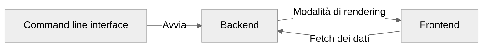
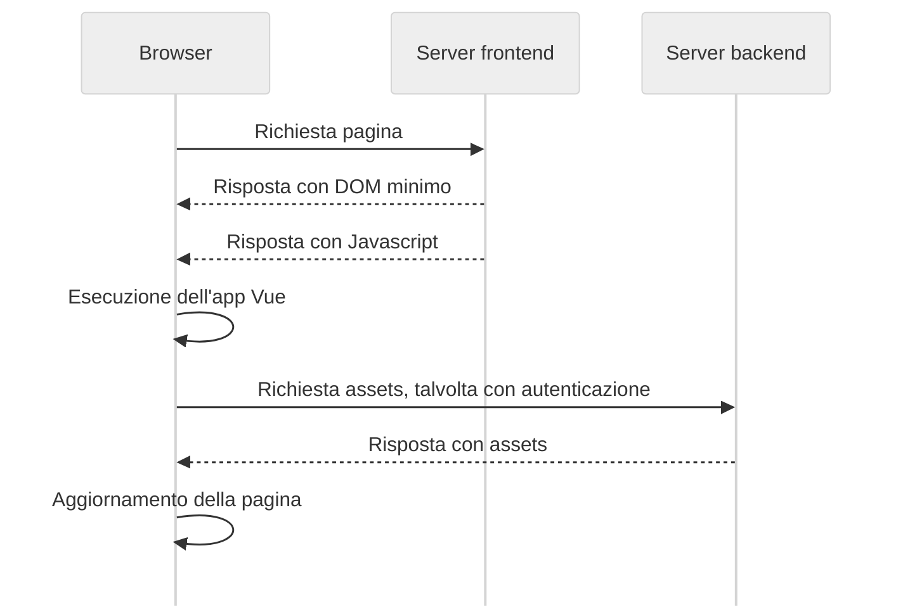
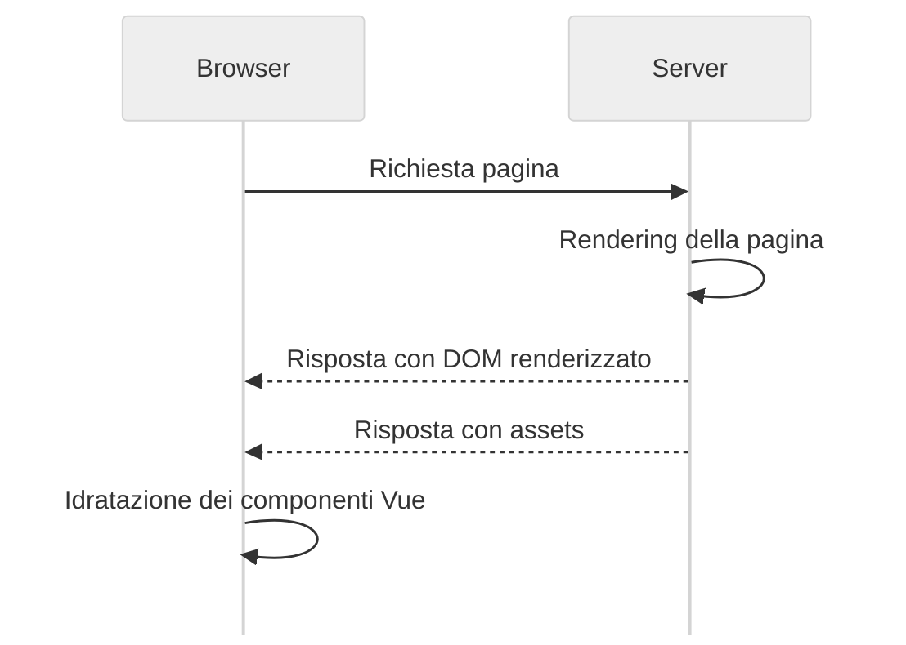

## Nuxt

Nuxt è un framework per applicazioni web, avviato come progetto Open source da Alexandre e Sebastien Chopin e Pooya Parsa nel 2016, che continua ad essere mantenuto attivamente su Github da un team di sviluppatori che accettano contributi, all'indirizzo [github.com/nuxt/nuxt](https://github.com/nuxt/nuxt).

Nuxt si propone di risolvere i problemi di performance, di ottimizzazione e di accessibilità delle applicazioni basate su componenti con il suo sistema di frontend, ma anche di fornire un ambiente di sviluppo flessibile, per facilitare la scalabilità e la manutenibilità del codice backend. Si possono infatti realizzare applicazioni **fullstack** secondo il pattern MVC, in cui la view è implementata con Vue ed il controller con _Nitro_, un server http fatto su misura per Nuxt.


> L'architettura generale di una applicazione Nuxt. Si noti che la View adotta a sua volta il pattern _MVVM_ quindi si hanno due modelli dei dati con interfacce potenzialmente distinte. Infatti nel modo tradizionale di usare Vue, backend e frontend potrebbero essere viste come due applicazioni a bassa coesione (basti pensare a come potrebbero essere realizzate in due linguaggi di programmazione differenti) ed alto accoppiamento (nel senso che un cambiamento da un lato potrebbe richiedere un altro cambiamento dall'altro lato del sistema, per mantenere la coerenza). Nuxt si occupa appunto di gestire la **comunicazione tra i due models**: il model dei dati persistenti ed il model dell'applicazione che esegue nel browser, in modo da ottenere _loose coupling_ e _high cohesion_.

Lo slogan di Nuxt è "The Intuitive Vue Framework", che è in accordo con il suo obiettivo di semplificare la creazione di applicazioni web fornendo un'infrastruttura preconfigurata e pronta all'uso. In questo modo lo sviluppatore può concentrarsi da subito sulla logica dell'applicazione, piuttosto che sulla configurazione del progetto. È quindi ricalcato il punto di vista di David Heinemeier Hansson su Rails, il framework per applicazioni web per Ruby che ideò nel luglio 2004, per il quale sosteneva il principio "convention over configuration"[^convention-over-configuration].

Nonostante questo, Nuxt utilizza internamente tecnologie raffinate, come Typescript e Vite, che consentono di scrivere codice robusto. Con Nuxt si possono realizzare applicazioni di vario genere, come siti vetrina, blog, documentazioni o wiki, e-commerce, dashboard gestionali, piattaforme di social networking, applicazioni mobile-first, etc...

La repository di sviluppo di Nuxt è organizzata secondo il modello di _monorepo_, quindi include pacchetti funzionanti in maniera disaccoppiata, ma che sono usati tutti in maniera coesa all'interno del sistema Nuxt. La versione corrente è la **3.15**, rilasciata nel dicembre 2024. La struttura del monorepo è la seguente:

-   `packages/nuxt` è il core del framework.
-   `packages/nuxi` è lo strumento da linea di comando per la creazione di nuovi progetti, ora spostato su [github.com/nuxt/cli](github.com/nuxt/cli).
-   `packages/schema` contiene le definizioni dei tipi di dati utilizzati.
-   `packages/kit` è un toolkit per la creazione di moduli aggiuntivi.
-   `packages/test-utils` contiene degli script per il testing di unità.
-   `packages/vite` è una fork di Vite, un bundler per gli script di frontend, usato di default da Nuxt.
-   `packages/webpack` è una fork di Webpack, un'altro bundler per gli script di frontend che si può scegliere in alternativa a Vite.
-   `docs` è la documentazione ufficiale, scritta sotto forma di sito web statico, usando Nuxt stesso.

Si possono proporre contribuiti su Github e l'iter consigliato varia in base al tipo di modifica:

-   Per proporre un **Bugfix** si apre un _issue_[^github-issue] per discutere il problema, e poi si apre una _pull request_ che risolva l'issue.

-   Per proporre una **Nuova funzionalità** si apre una _discussion_, e poi di aprire una _pull request_ che implementi la funzionalità.

[^github-issue]: Si tratta di un thread aggiunto alla sezione "Issues", che funziona come un forum specifico per ogni progetto, accessibile a tutti gli utenti registrati di Github.

I contributi poi vengono sottoposti a test automatici prima di essere passati ad una revisione da parte del team di sviluppo, in modo da conformare lo stile del codice, della documentazione ed anche del messaggio di commit. Le etichette fornite nelle _PR_ più comunemente sono: `enhancement`, `nice-to-have`, `bug`, `discussion`, `documentation`, `performance` e `refactor`.

Al Novembre 2024, sono stati aperti circa 15'000 issues, sono stati avanzati circa 7'000 commit da più di 700 contributori. I progetti Open source su Github che usano Nuxt sono circa 350'000 e questi numeri sono in costante crescita.

Oltre a modificare la monorepo, gli sviluppatori Open source sono invitati a creare moduli per estendere le Nuxt con funzionalità non essenziali, ma idonee per l'interoperabilità con altri software. Questi moduli possono essere pubblicati su Npm come pacchetti, con `@nuxt/kit` come dipendenza, ed al Dicembre 2024 se ne contano più di 200[^moduli-nuxt].

La versione vanilla di Nuxt propone un'intelaiatura che include una command line interface con cui si definisce il funzionamento del backend, che determina il modo in cui il frontend verrà mostrato agli utenti. Il frontend, a sua volta, è in comunicazione con il backend per ottenere dati aggiornati.

In questo schema sono mostrate queste parti e le loro interazioni:



[^convention-over-configuration]: [Wikipedia - Convention over configuration](https://en.wikipedia.org/wiki/Convention_over_configuration)

### Command line interface

L'ecosistema Nuxt fa uso di un programma invocabile da linea di comando chiamato _nuxi_. È installabile globalmente su un sistema provvisto di Node eseguendo `npm i -g @nuxt/cli`, e dispone di vari sotto-comandi per la gestione del progetto. È consigliato usare `npx nuxi <sotto-comando>` per evitare conflitti tra le versioni dei pacchetti installati localmente e globalmente: anteponendo "npx" si userà, se presente, la versione locale `node_modules/@nuxt/cli`.

#### `nuxi init <nome-progetto>`

È il comando per avviare un nuovo progetto nella directory `./<nome-progetto>`. Eseguendolo si dovrà scegliere il sistema di gestione dei pacchetti, che riguarderà il modo con il quale Nuxt ed anche gli agli altri pacchetti di terze parti saranno installati, e può essere tra:

-   **Npm**: Il classico package manager di Node, solitamente installato assieme ad esso scegliendo il pacchetto `node` nelle repository delle maggiori distribuzioni Linux, e disponibile di default nelle immagini Docker ufficiali di Node.
-   **Pnpm**: Un package manager alternativo a npm, progettato per migliorare le performance e ottimizzare l'utilizzo dello spazio su disco rispetto a npm, preferito per lo sviluppo locale.
-   **Yarn**: Un altro package manager alternativo a npm, sviluppato in Facebook nel 2016.
-   **Bun**: Con questa opzione si sceglie di usare una runtime diversa da Node: Bun, più efficiente in alcune operazioni di I/O, compatibile con le API Node e i suoi pacchetti di terze parti.
-   **Deno**: Un'altra runtime JavaScript che offre supporto nativo a Typescript, ma non è del tutto compatibile con alcuni pacchetti npm.

Subito dopo c'è la scelta **Initialize git repository**, che eseguirà `git init` se selezionata. Nella trattazione che segue adotteremo Npm come package manager e Git per il controllo di versione.

La directory `./nome-progetto` sarà indicata come `~`[^user-home], e conterrà i seguenti:

```bash
.git/				# Versioni dei file del progetto
.nuxt/				# Files temporanei usati dal server di sviluppo
.output/			# Files generati durante la build per la produzione
node_modules/		# Librerie di Nuxt e di terze parti
public/				# Risorse statiche da distribuire con l'applicazione
	robots.txt		# File di configurazione per i motori di ricerca
	favicon.ico		# Icona del sito
server/				# Directory preposta al codice riservato al server
	tsconfig.json	# Configurazione del compilatore Typescript per il backend
.gitignore			# Lista dei file da ignorare durante il versionamento
app.vue				# Entry point dell'applicazione
nuxt.config.ts		# File di configurazione di Nuxt
package-lock.json	# Albero delle versioni delle dipendenze
package.json		# Lista delle dipendenze e dei comandi di build
README.md			# Documentazione del progetto
tsconfig.json		# Configurazione del compilatore Typescript per il frontend
```

[^user-home]: Nel contesto di sistemi Unix-like, la tilde `~` è un alias per la directory home dell'utente corrente. Nei files di un'app Nuxt invece indica la directory radice del progetto.

#### `nuxi add`

Una volta inizializzato il progetto, questo è il comando per aggiungere funzionalità all'app. Prende come terzo argomento il tipo di template da aggiungere, che può essere tra:

-   **app**: Il componente Vue che fa da entry point dell'applicazione. È già presente di default in ogni progetto Nuxt, ma può essere sovrascritto con questo comando.
-   **page**: Una pagina web, che sarà accessibile alla rotta `/<nome-pagina>`.
-   **layout**: Un layout Vue, cioè un componente che definisce la struttura di una o più pagine. È un modo di riutilizzare il codice HTML e CSS in più parti dell'applicazione.
-   **component**: Un componente Vue, riutilizzabile in tutte le pagine o layout.
-   **error**: Un componente Vue che sarà mostrato in caso di errore.
-   **middleware**: Un middleware, cioè una funzione che può essere eseguita prima di caricare una pagina, lato server o lato client.
-   **composable**: Una funzione che può essere usata in uno o più componenti Vue. È un modo per riutilizzare la logica di business in più parti dell'applicazione.
-   **plugin**: Uno script typescript che viene eseguito prima di inizializzare l'applicazione Vue. Utile per l'inizializzazione di componenti software di terze parti. A differenza dei middleware, i plugin vengono eseguiti solo una volta, all'avvio dell'applicazione.
-   **api**: Un endpoint API, che sarà accessibile alla rotta `/api/<nome-endpoint>`. Utile per la comunicazione tra frontend e backend.
-   **server-route**: Un endpoint API, che sarà accessibile alla rotta `/<nome-endpoint>`.
-   **server-middleware**: Un middleware, simile a quelli di Express, che si interpone tra
-   **server-plugin**: Uno script typescript che viene eseguito prima di inizializzare il server Nitro. Utile per l'inizializzazione di componenti software di terze parti.
-   **server-util**: Un modulo typescript importato automaticamente in ogni file di tipo server.
-   **module**: Con questa opzione si crea un modulo Nuxt per sperimentarlo, e che potrà essere utilizzato anche in altri progetti.

Ogni aggiunta corrisponde ad un nuovo file che verrà creato nella directory corrispondente, provvisto di un _boilerplate_[^boilerplate], che sarà possibile modificare per adattarlo alle proprie esigenze.

[^boilerplate]: Cioè del codice ripetuto frequentemente.

#### `nuxi dev`

Una volta aggiunte le prime funzionalità si può lanciare il server di sviluppo, che permette di testare l'applicazione in locale. Di default il server è accessibile alla rotta `http://localhost:3000`, ma si può cambiare la porta con l'opzione `--port <numero-porta>`. Il server di sviluppo è dotato nativamente di _hot reloading_, cioè la capacità di ricaricare automaticamente la pagina web quando si salvano i file del progetto, in modo da velocizzare il feedback del sistema al programmatore.

#### `nuxi devtools`

Abilita o disabilita l'iniezione degli script Devtools nell'app Vue, quando è lanciata con `nuxi dev`. Sono un set di strumenti il debugging di applicazioni Nuxt, aggiuntivi a quelli già presenti nei browser moderni[^devtools].

Viene aggiunto un elemento html alla pagina, nel quale sono presenti diverse sezioni che mostrano informazioni di profilazione dell'app in sviluppo, tra cui:

-   **Pages**: Lista delle pagine dell'applicazione, con la possibilità di navigare tra di esse.
-   **Components**: Lista dei componenti Vue inseriti nel bundle, con riferimenti e dipendenze.
-   **Components tree**: Albero dei componenti Vue della pagina corrente. Fornisce una visualizzazione più ordinata rispetto ai devtools del browser.
-   **Imports**: Lista dei composables inseriti nel bundle.
-   **Modules**: Lista dei moduli utilizzati dall'applicazione, lato server o client.
-   **Assets**: Risorse statiche usate dall'applicazione, come immagini, font, icone, etc...
-   **Open Graph**: Metadati Open Graph[^open-graph] della pagina corrente, utili per la condivisione sui social network.
-   **Timeline**: Un grafico che mostra il tempo di rendering delle pagine, dei componenti e dei moduli.
-   **Hooks**: Lista dei hooks, cioè delle funzioni che vengono eseguite in determinati momenti del ciclo di vita dell'applicazione e dei singoli componenti.
-   **Server routes**: Un modo per visualizzare le rotte del server Nitro e fare delle richieste di test, con possibilità di aggiungere parametri GET, body POST, header, cookies e di simulare la provenienza della richiesta dall'app.
-   **Inspect**: In questa sezione il codice dei file vue e typescript per il frontend viene riportato con tutti gli stage di compilazione, fino al codice Javascript finale eseguito dal browser.

> {width=70%}

[^devtools]: Come quelli di [Firefox](https://firefox-source-docs.mozilla.org/devtools-user/), dei derivati di [Chromium](https://developer.chrome.com/docs/devtools?hl=it), di [Safari](https://developer.apple.com/safari/tools/) ed di [Edge](https://learn.microsoft.com/en-us/microsoft-edge/devtools-guide-chromium/overview).
[^open-graph]: [Open Graph Protocol](https://ogp.me/#metadata) - Protocollo per l'inserimento di metadati nelle pagine web, che saranno mostrati come copertina quando la pagina viene condivisa sui social network.

#### `nuxi module`

Ha due ulteriori sottocomandi, `search` e `add`, che permettono di cercare e aggiungere moduli Nuxt, tra quelli ufficialmente supportati[^moduli-nuxt].

#### `nuxi typecheck`

Consente di eseguire il controllo statico del codice Typescript, per trovare errori di sintassi e di logica prima di eseguire la build dell'applicazione, anche nei file Vue. Richiede l'installazione di `vue-tsc` come dipendenza di sviluppo.

#### `nuxi test`

Esegue i test definiti in `~/tests`. Richiede l'installazione di `@nuxt/test-utils` come dipendenza di sviluppo. In questo modo si possono avviare i testi di

-   Unità: sono i test che verifica il comportamento di una singola funzione o di un singolo componente secondo la previsione del programmatore. Sono implementati con `vitest`, di default, o `jest`.
-   Componenti: permettono di verificare il corretto funzionamento di un singolo componente e dei composable ad esso associati.
-   Integrazione: si tratta di test che verificano il corretto funzionamento di più componenti insieme, con un mock del router. Questo tipo di test garantisce che, ad un'aggiunta di un nuovo componente, non si verifichino errori di rendering o di logica con i componenti già esistenti.
-   End-to-end (E2E): questo tipo di test simula l'interazione di un utente con l'applicazione, attraverso un browser virtuale, implementato con `playwright` o `puppeteer`. Questo tipo di test garantisce che l'applicazione sia accessibile e usabile da un utente reale, mitigando i problemi di accessibilità tipici single page applications.

```typescript
describe("CounterWithComposable Component", () => {
	it("è renderizzato correttamente", () => {
		const wrapper = mount(CounterWithComposable);
		expect(wrapper.text()).toContain("Count: 0");
	});

	it("incrementa il valore quando il bottone Increment è premuto", async () => {
		const wrapper = mount(CounterWithComposable);
		await wrapper.find("button:first-of-type").trigger("click");
		expect(wrapper.text()).toContain("Count: 1");
	});

	it("decrementa il valore quando il bottone Decrement è premuto", async () => {
		const wrapper = mount(CounterWithComposable);
		await wrapper.find("button:last-of-type").trigger("click");
		expect(wrapper.text()).toContain("Count: -1");
	});
});
```

> Esempio di test di un componente Vue con `vitest`. Il test verifica che il componente `CounterWithComposable` sia renderizzato e funzioni correttamente. C'è da notare che con l'utilizzo dei test Vite la funzionalità di importazione automatica di Nuxt è disabilitata, quindi si può procedere con il _mocking_ delle dipendenze (implementando un comportamento fasullo) o con l'importazione di `ref` e del composable `useCounter` all'interno dei componenti da testare.

#### `nuxi build`

Compila il codice Typescript e genera i file necessari per la distribuzione dell'applicazione. I file generati sono salvati nella directory `./.output`, e possono essere distribuiti su un server web per la produzione. L'albero delle dipendenze viene ridotto al minimo con una procedura chiamata _tree-shaking_ e le dipendenze necessarie e sufficienti per l'esecuzione dell'applicazione vengono copiate in `./.output/server/node_modules`. L'app può essere avviata con `node ./.output/server/index.mjs`.

#### `nuxi cleanup`

Rimuove i file temporanei e i file generati durante la build.

### Frontend

Nuxt adotta delle convenzioni per il frontend: i file che definiscono le pagine accessibili all'utente sono organizzate in una struttura gerarchica di directory. Ogni pagina può essere inclusa in un layout, che definisce la struttura generale della pagina, e può usare dei middleware, che sono delle funzioni che vengono eseguite prima di caricare la pagina. Ogni componente di cui le pagine sono composte può essere definito in un file separato, per favorire il riutilizzo del codice. Tutti i file Vue che seguono le convenzioni di Nuxt sono importati automaticamente.

#### Pages

La struttura delle pagine è la seguente:

```bash
pages/
	index.vue			# Pagina principale, accessibile alla rotta /
	about.vue			# Pagina accessibile alla rotta /about

	gruppo-1/			# Gruppo di pagine, influenza la rotta
		pagina-1.vue	# Pagina accessibile alla rotta /gruppo-1/pagina-1
		pagina-2.vue	# Pagina accessibile alla rotta /gruppo-1/pagina-2

	(gruppo)/			# Gruppo di pagine, non influenza la rotta
		pagina-1.vue	# Pagina accessibile alla rotta /pagina-1
		pagina-2.vue	# Pagina accessibile alla rotta /pagina-2

	[id].vue			# Pagina accessibile a /<id>.
	[...id].vue			# Pagina accessibile a /<id[0]>/<id[1]>/<id[2]>...
	gruppo-[nome]/		# Gruppo di pagine con variabile <nome>, influenza la rotta
		pagina-1.vue	# Pagina accessibile a /gruppo-<nome>/pagina-1
```

<!-- TODO -->

```html
<script setup lang="ts">
	definePageMeta({
		middleware: ["testmiddleware"],
		layout: "testlayout",
	});
</script>

<template>
	<!-- Utilizzo di componenti -->
</template>

<style scoped>
	/* Stili CSS */
</style>
```

##### Script

##### Template

##### Style

setup
import automatici

lang="ts"

definePageMeta
macro del compilatore

scoped
limita l'applicazione delle regole css al solo componente nel quale è definito

rotte

```typescript
definePageMeta(meta: PageMeta) => void

interface PageMeta {
  validate?: (route: RouteLocationNormalized) => boolean | Promise<boolean> | Partial<NuxtError> | Promise<Partial<NuxtError>>
  redirect?: RouteRecordRedirectOption
  name?: string
  path?: string
  props?: RouteRecordRaw['props']
  alias?: string | string[]
  pageTransition?: boolean | TransitionProps
  layoutTransition?: boolean | TransitionProps
  viewTransition?: boolean | 'always'
  key?: false | string | ((route: RouteLocationNormalizedLoaded) => string)
  keepalive?: boolean | KeepAliveProps
  layout?: false | LayoutKey | Ref<LayoutKey> | ComputedRef<LayoutKey>
  middleware?: MiddlewareKey | NavigationGuard | Array<MiddlewareKey | NavigationGuard>
  scrollToTop?: boolean | ((to: RouteLocationNormalizedLoaded, from: RouteLocationNormalizedLoaded) => boolean)
  [key: string]: unknown
}
```

#### Components

Componenti _built-in_:

-   `<ClientOnly>`
-   `<DevOnly>`
-   `<NuxtErrorBoundary>`
-   `<NuxtImg>`
-   `<NuxtLayout>`
-   `<NuxtLink>`
-   `<NuxtLoadingIndicator>`
-   `<NuxtPicture>`
-   `<NuxtRouteAnnouncer>`
-   `<NuxtWelcome>`
-   `<ServerPlaceholder>`

hooks

setup
abilita la composition api

reattività dei componenti

sintassi vue

```html
<!-- i "moustache" permettono di interpolare il valore di una variabile -->
<p>{{ message }}</p>
```

#### Layouts

uso di css custom

https://github.com/nuxt/nuxt/issues/23009#issue-1881478762
https://github.com/nitrojs/nitro/discussions/235

.nuxt.config.ts

### Modalità di rendering del frontend

<!-- TODO https://www.youtube.com/watch?v=b1S5os65Urs -->

Durante la fase di progettazione, diversi tipi di applicazione suggeriscono diverse esigenze, e Nuxt si dimostra versatile a partire dalle modalità di rendering che offre.

In questo contesto, con rendering di una pagina web non si intende il processo di disegno dei pixel sullo schermo, del quale generalmente si occuperà il browser web delegando al sistema operativo la gestione dell'hardware. Qui con rendering si intende il processo di generazione del codice HTML, CSS e Javascript che costituisce la pagina web.

#### Routing unificato

#### Client Side Rendering



Nuxt supporta la stessa modalità di rendering discussa nel [capitolo 1](#vue.js), in cui il codice dell'applicazione Vue viene eseguito interamente sul browser.

Si può attivare globalmente nel file `nuxt.config.ts` con:

```typescript
export default defineNuxtConfig({
	ssr: false,
});
```

Il beneficio che si ottiene nello sviluppare in maniera CSR con Nuxt è la disponibilità del classico oggetto `window` negli script Vue, oltre ad una riduzione del costo infrastrutturale, perché il server backend non deve eseguire il codice Javascript per generare la pagina: basterà infatti caricare il bundle dell'applicazione frontend generata con `nuxi build` su un server frontend statico [^server-frontend]. Tuttavia rimangono i problemi di performance, di accessibilità e di SEO che sono stati discussi [precedentemente](#ritorno-al-server-side-rendering).

[^server-frontend]: Si tratta di un servizio di file statici, che può essere implementato anche con una _CDN_ (Content Delivery Network) per distribuire i file in maniera efficiente in tutto il mondo.

#### Universal rendering



#### Static Site Generation

md -> html

#### Routes tipizzate

tipi di fetch

COME FANNO AD ESSERCI DELLE ROUTES TIPIZZATE??
controllare

#### Modalità di sviluppo

#### Build per la produzione

Nel [capitolo 3](#soluzioni-di-design) si illustrerà un modulo che permette di usare Nuxt in combinazione con TypeORM.

[^moduli-nuxt]: [Moduli supportati ufficialmente da Nuxt](https://nuxt.com/modules)

---