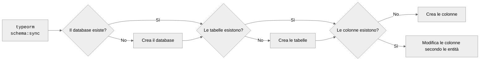
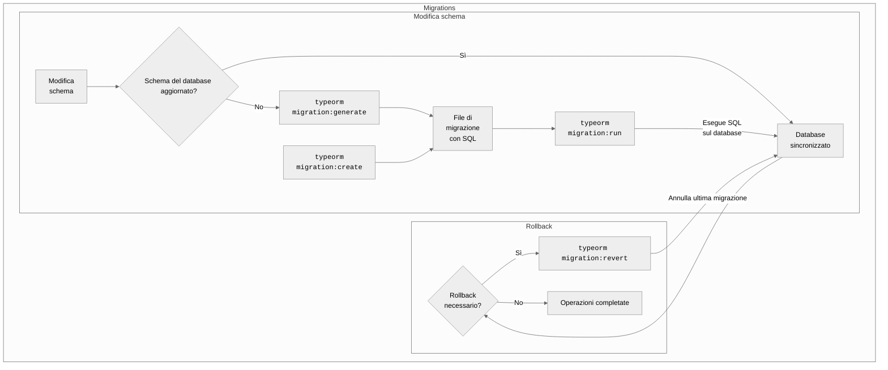
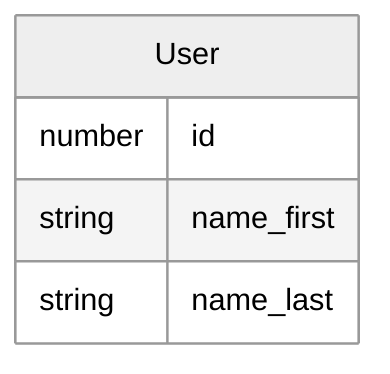
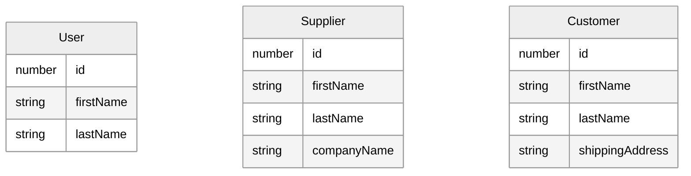
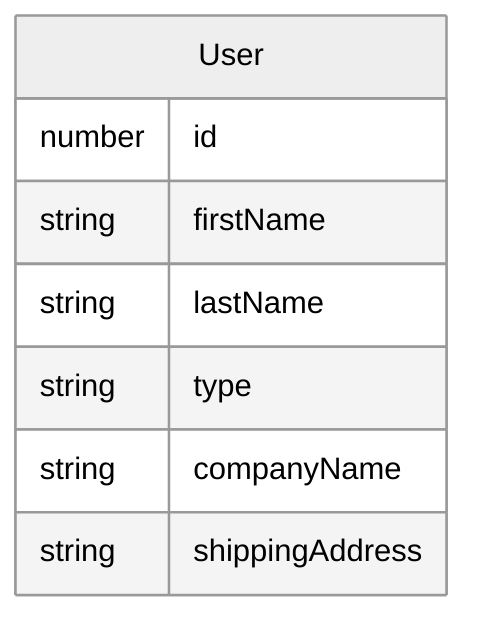

## TypeORM

TypeORM è un ORM (Object-Relational Mapping) basato su Typescript, che permette di rappresentare le entità e le relazioni di un database relazionale in modo dichiarativo, e di eseguire operazioni _CRUD_ (Create, Read, Update, Delete) su di esse con API type-safe.

Il progetto, avviato nel 2016 da Umed Khudoiberdiev, è attualmente mantenuto da un team di sviluppatori che accettano contributi, all'indirizzo [github.com/typeorm/typeorm](github.com/typeorm/typeorm). La versione stabile corrente è la **0.3.20**, rilasciata nel gennaio 2024, ma lo sviluppo di versioni _nightly_ è in corso. Attualmente TypeORM è usato come dipendenza in quasi 400'000 progetti su Github.

Si può installare in un progetto Node con `npm install typeorm`, e richiede `typescript` con versione 4.5 o successiva, con le dichiarazioni di tipo `@types/node`. L'uso di TypeORM come libreria in un tag script di un file HTML non è supportato.

### Command line interface

Si può avviare un progetto con la CLI di TypeORM con `npx typeorm init --database <database>`, scegliendo tra i seguenti database: `mysql`, `mariadb`, `postgres`, `cockroachdb`, `sqlite`, `mssql`, `sap`, `spanner`, `oracle`, `mongodb`, `cordova`, `react-native`, `expo`, `nativescript`. Una volta che il progetto è configurato si possono eseguire i seguenti comandi:

#### `typeorm entity:create <percorso>`

Genera il file di una nuova entità in una directory specificata. Si tratta di un file Typescript che rappresenta una tabella del database, con i campi e le relazioni definite come proprietà della classe.

#### `typeorm schema:sync`

Sincronizza il database con le entità definite nel progetto.
Il protocollo di sincronizzazione è evidenziato nel diagramma di flusso sotto.



#### `typeorm schema:drop`

Elimina tutte le tabelle del database.

#### `typeorm schema:log`

Stampa su _stdout_ le query SQL che verranno eseguite dal comando `schema:sync`.

#### `typeorm query <query>`

Esegue una query SQL sul database, nel dialetto del DBMS specificato.

#### `typeorm cache:clear`

Svuota la cache delle query.

#### `typeorm subscriber:create <percorso>`

Crea un nuovo subscriber, cioè una funzione che viene eseguita quando si verifica un evento sul database.

#### `typeorm migration:create <percorso>`

Crea un nuovo file di migrazione, che potrà essere utilizzato per sincronizzare il database successivamente.

#### `typeorm migration:run`

Esegue tutte le migrazioni pendenti, cioè le modifiche allo schema del database che non sono state ancora applicate.

#### `typeorm migration:show`

Stampa su stdout le migrazioni pendenti.

#### `typeorm migration:revert`

Annulla l'ultima migrazione eseguita.

#### `typeorm migration:generate <percorso>`

Genera una migration a partire dalle differenze tra le entità e le tabelle del database.



> Diagramma di flusso delle migrazioni in TypeORM. L'esecuzione del SQL è specifica per il DBMS scelto, e può essere differente tra i vari database supportati.

### Collegamento con il database

TypeORM consente di lavorare con diversi DBMS (Database Management Systems), tra cui:

|        DBMS:         |  Relazionale?   | Server based? | Adattatore: |
| :------------------: | :-------------: | :-----------: | :---------: |
|   MySQL o MariaDB    |       ✅        |      ✅       |  `mysql2`   |
|      PostgreSQL      |       ✅        |      ✅       |    `pg`     |
|        SQLite        |       ✅        |    su file    |  `sqlite3`  |
|        Sql.js        |       ✅        |  in memoria   |  `sql.js`   |
| Microsoft SQL Server |       ✅        |      ✅       |   `mssql`   |
|       OracleDB       |       ✅        |      ✅       | `oracledb`  |
|       MongoDB        | ❌, a documenti |      ✅       |  `mongodb`  |
|       SAP Hana       |       ✅        |  in memoria   | `hdb-pool`  |
| Google Cloud Spanner |       ✅        |      ✅       |  `spanner`  |

Per effettuare la connessione con il database occorre installare l'adattatore mediante npm, e configurare un istanza di `DataSource` con le opzioni di accesso al database.

Ad esempio, in PostgreSQL:

```typescript
import { DataSource } from "typeorm";
import type { DataSourceOptions } from "typeorm";

let options: DataSourceOptions = {
	type: "postgres",
	host: "localhost",
	port: 5432,
	database: "dev",
	username: "dev",
	password: "dev",
	ssl: true,
	connectTimeoutMS: 10000,
	synchronize: true,
	logging: true,
	entities: [],
	migrations: [],
	subscribers: [],
};

const AppDataSource = new DataSource(options);
```

Le opzioni di connessione sono specifiche per ogni adattatore, ma quelle comuni sono:

-   `type: string`: il tipo di database, tra quelli supportati da TypeORM. In base a questo campo il compilatore Typescript inferirà il tipo specifico delle opzioni.
-   `entities: EntitySchema[]`: un array di classi che rappresentano le migrazioni del database
-   `migrations: Function[]`: un array di classi che rappresentano le migrazioni del database.
-   `subscribers: Function[]`: un array di classi che rappresentano i subscriber del database.
-   `synchronize: boolean`: indica se sincronizzare il database con le entità definite nel progetto.
-   `logging: boolean | ["query", "error", "schema", "warn", "info", "log"]`
    `| AbstractLogger`: abilita la stampa su stdout delle query SQL eseguite sul database durante l'esecuzione dell'applicazione e permette di specificare quali tipi di log abilitare o di passare un logger personalizzato.
-   `cache: boolean | {type: ["database", "redis", ...],options: {...} }`: abilita la cache delle query, con la possibilità di specificare il tipo di cache, tra le quali anche Redis.

Per i DBMS che richiedono una connessione a server, si aggiungono le opzioni:

-   `host: string`: l'indirizzo IP o il nome del server.
-   `port: number`: la porta del server.
-   `database: string`: il nome del database.
-   `username: string`: l'utente del database.
-   `password: string`: la password dell'utente.
-   `ssl: boolean`: abilita la connessione sicura.

In più, per PostgreSQL, si può specificare:

-   `connectTimeoutMS: number`: il tempo massimo di attesa per la connessione al server, in millisecondi.
-   `uuidExtension: boolean`: abilita l'estensione UUID di PostgreSQL.

[^data-source-options]: È possibile consultare quali opzioni sono disponibili per i vari adattatori [qui](https://typeorm.io/data-source-options).

In un'applicazione Typescript che viene impacchettata per l'utilizzo su client (browser) si può usare il modulo `typeorm/browser` per interagire con `indexedDB`, un database locale che è supportato da tutti i browser moderni, per memorizzare i dati in locale.

```typescript
import { DataSource } from "typeorm/browser";

const AppDataSource = new DataSource({
	type: "indexeddb",
	database: "mydb",
	entities: [],
	synchronize: true,
});
```

Successivamente si può inizializzare la connessione con il database con il metodo `initialize`, per iniziare a fare queries.

```typescript
export async function initialize() {
	try {
		if (!AppDataSource.isInitialized) {
			await AppDataSource.initialize();
			console.log("Typeorm inizializzato");
		}
	} catch (error) {
		console.error("Errore inizializzazione Typeorm", error);
		throw error;
	}
}
```

Questa operazione è asincrona, quindi si può usare `await` per attendere il completamento dell'inizializzazione, ed è da preferire eseguirla all'avvio dell'applicazione, per evitare errori di connessione al database durante l'esecuzione.

### Rappresentazione di entità

#### Entità

Una delle features principali di TypeORM è la possibilità di definire le entità del database come classi Typescript con _decoratori_[^decoratori], al contrario di altri ORM che usano un formato di configurazione esterno, come Prisma, o che usano un formato di configurazione interno, come Sequelize.

[^decoratori]: I decoratori sono funzioni che modificano il comportamento di una classe o di una funzione, aggiungendo o modificando proprietà o metodi. Sono stati introdotti in ES7 e sono supportati da Typescript.

È necessario installare uno _shim_ (una libreria che si interpone tra due API) per poter usare i decoratori di TypeORM, con `npm install reflect-metadata --save`.

È inoltre necessario configurare il compilatore typescript per supportare i decoratori, aggiungendo le seguenti opzioni al file `tsconfig.json`:

```json
{
	"compilerOptions": {
		"experimentalDecorators": true,
		"emitDecoratorMetadata": true
	}
}
```

Poi bisogna importare il modulo `reflect-metadata` globalmente in un file di entry del progetto:

```typescript
import "reflect-metadata";
```

Si potrà quindi definire la tabella `users` con la classe `User`:

```typescript
export class User {
	public id: number;
	public firstName: string;
	public lastName: string;
	public fullName(): string {
		return `${this.firstName} ${this.lastName}`;
	}
}
```

Poi si annota la classe con il decoratore `@Entity`:

```typescript
import { Entity } from "typeorm";
@Entity()
export class User {
	// ...
}
```

E successivamente si annotano i campi che si intende tradurre in colonne della tabella con il decoratore `@Column`:

```typescript
import { Entity, Column } from "typeorm";
@Entity()
export class User {
	@Column()
	public id: number;
	@Column()
	public firstName: string;
	@Column()
	public lastName: string;
	public fullName(): string {
		return `${this.firstName} ${this.lastName}`;
	}
}
```

In questo modo il tipo di dato da assegnare alla colonna è inferito automaticamente dal tipo della proprietà, e si può continuare ad usare il metodo `fullName` per ottenere il nome completo dell'utente.

Per rendere le entità persistenti si devono aggiungere i riferimenti delle classi ad un array nel campo `entities` delle opzioni di `DataSource`.

#### Entità annidate

Un'entità può supportare delle entità annidate, che sono rappresentate come proprietà di tipo `Entity`:

```typescript
import { Name } from "./Name";

@Entity()
export class User {
	@Column()
	id: number;

	@Column(() => Name)
	name: Name;
}
```

Dove `Name` è una classe che rappresenta un nome, con delle `@Column` sui campi da annidare.

```typescript
export class Name {
	@Column()
	first: string;

	@Column()
	last: string;
}
```

In questo modo la tabella risultante sarà:



Quindi si potrà accedere ai campi annidati con `user.name.first` e `user.name.last`, e per ogni entità che fa uso di `Name` si otterrà una riduzione della ridondanza del codice.

#### Polimorfismo delle entità

Le entità possono essere definite in modo polimorfico, cioè con una gerarchia di classi che condividono delle proprietà comuni.

Si inizia definendo un'entità padre `User`:

```typescript
@Entity()
export class User {
	@Column()
	id: number;

	@Column()
	firstName: string;

	@Column()
	lastName: string;
}
```

Poi si definiscono le entità figlie `Admin` e `Customer`:

```typescript
@Entity()
export class Supplier extends User {
	@Column()
	companyName: string;
}
```

```typescript
@Entity()
export class Customer extends User {
	@Column()
	shippingAddress: string;
}
```

Il diagramma delle tabelle risultante sarà:



L'ereditarietà è supportata ad un livello di profondità arbitrario.

È possibile usare anche il pattern di _Single table inheritance_ (STI), in cui tutte le entità figlie condividono la stessa tabella, e si usa un campo `type` per distinguere i diversi tipi di entità.

```typescript
@Entity()
@TableInheritance({ column: { type: "varchar", name: "type" } })
export class User {
	...
}

export class Supplier extends User {
	...
}

export class Customer extends User {
	...
}
```

Così facendo si otterrà un'unica tabella `User` con un campo `type` che può assumere i valori `Supplier` e `Customer`:



#### Schemi

È anche possibile definire uno schema per le tabelle, senza l'utilizzo di decoratori, facendo utilizzo di interfacce Typescript e di classi EntitySchema con un parametro _generic_ dell'interfaccia in considerazione. l'esempio del paragrafo [entità annidate](#entità-annidate) può essere riscritto come:

```typescript
export interface Name {
	first: string
	last: string
}

export const NameEntitySchema = new EntitySchema<Name>({
    name: "name",
    columns: {
        first: { type: "varchar" },
        last: { type: "varchar" },
    },
})

export interface User {
    id: string
    name: Name
}

export const UserEntitySchema = new EntitySchema<User>({
    name: "user",
    columns: {
        id: { primary: true, type: "int", generated: true },
    },
    embeddeds: {
        name: { schema: NameEntitySchema, prefix: "name_" }
    },
})
```

Si passa un oggetto di tipo `EntitySchemaOptions` al costruttore di `EntitySchema`, che contiene le opzioni di configurazione della tabella, tra cui:

-   `name: string`: il nome della tabella.
-   `columns: EntitySchemaOptions<T>.columns`: un oggetto che mappa i nomi delle colonne, tipizzati come string literals, ad ulteriori opzioni della colonna, cioè ad un `EntitySchemaColumnOptions`. Ognuno di questi ha i campi:
	-	`type: ColumnType`: il tipo di dato della colonna, istanza di `ColumnType`.
	-	`primary?: boolean`: se la colonna è parte della chiave primaria, `false` di default.
	-	`generated?: boolean`: se il valore della colonna è generato automaticamente, `false` di default.
	-	`default?: any`: il valore di default della colonna.
-  `embeddeds: EntitySchemaColumnOptions[]`: un oggetto che mappa i nomi delle proprietà annidate ai loro schemi e ai prefissi delle colonne annidate. Per ogni proprietà annidata si deve definire:
	-	`schema: EntitySchema`: lo schema dell'entità annidata.
	-	`prefix: string`: il prefisso delle colonne annidate.

La tipizzazione forte è garantita anche nel caso degli schemi.

#### Proprietà delle colonne

Nelle `@Entity` si possono impostare proprietà delle colonne del database sempre mediante decoratori:

-   `@PrimaryGeneratedColumn()`: Chiave primaria generata automaticamente.
-   `@PrimaryColumn()`: Chiave primaria.
-   `@Column("int")`: Tipo di dato della colonna. Un `number` Typescript può essere mappato a `int` in SQL.
-   `@Column("varchar")` oppure `@Column("text")`: Tipo di dato della colonna. Una `string` Typescript può essere mappata a `varchar` o `text` in SQL.

Si possono aggiungere delle proprietà aggiuntive passando un oggetto di opzioni, di tipo `ColumnOptions`, al decoratore `@Column(options: ColumnOptions)`:

Alcune delle opzioni più comuni per PostgreSQL sono:

-   `type: ColumnType`: Il tipo di dato della colonna, istanza di `ColumnType`, tra i quali:
    -   `"int"`: Un intero a 32 bit.
    -   `"bigint"`: Un intero a 64 bit.
    -   `"varchar"`: Una stringa di lunghezza variabile.
    -   `"text"`: Una stringa di lunghezza arbitraria.
    -   `"boolean"`: Un valore booleano.
    -   `"date"`: Una data.
    -   `"timestamp"`: Una data e un orario.
    -   `"json"`: Un oggetto JSON. Con questo tipo si possono memorizzare oggetti complessi, come array e oggetti annidati, ma per le operazioni di ricerca e ordinamento. È preferibile usare un tipo di dato nativo del database.
    -   `"jsonb"`: Un oggetto JSON binario.
    -   `"enum"`: Un insieme di valori possibili. Si definisce con un array di stringhe, che viene tipizzato come uno _string literal type_, o anche con un enum Typescript. In entrambi i casi la tipizzazione è garantita.
-   `length: number`: La lunghezza massima della colonna, per i tipi `varchar` e `text`.
-   `nullable: boolean`: Se la colonna può avere valori nulli.
-   `default: any`: Il valore di default della colonna.
-   `unique: boolean`: Se i valori della colonna devono essere unici.
-   `primary: boolean`: Se la colonna è parte della chiave primaria.
-   `generated: boolean`: Se il valore della colonna è generato automaticamente.
-   `comment: string`: Un commento sulla colonna.

#### Migrations

Infine, per modificare lo schema del database, una volta che le entità sono definite, si possono creare delle migrazioni, che sono file Typescript che contengono le query SQL necessarie per modificare lo schema del database.

```typescript
import { MigrationInterface, QueryRunner } from "typeorm";

export class PostRefactoringTIMESTAMP implements MigrationInterface {
	async up(queryRunner: QueryRunner): Promise<void> {
		await queryRunner.query(
			`ALTER TABLE "user" RENAME COLUMN "lastname" TO "surname"`
		);
	}
	async down(queryRunner: QueryRunner): Promise<void> {
		await queryRunner.query(
			`ALTER TABLE "user" RENAME COLUMN "surname" TO "lastname"`
		); 
	}
}
```

È anche disponibile l'API `QueryRunner`, che permette di astrarre parti di sintassi SQL specifiche per i vari DBMS, ma i parametri delle query non sono tipizzati.

```typescript
import { MigrationInterface, QueryRunner, TableColumn } from "typeorm";

export class PostRefactoringTIMESTAMP implements MigrationInterface {
	async up(queryRunner: QueryRunner): Promise<void> {
		await queryRunner.renameColumn("user", "lastname", "surname");
	}

	async down(queryRunner: QueryRunner): Promise<void> {
		await queryRunner.renameColumn("post", "surname", "lastname");
	}
}
```

La pratica di migrazione di database è tuttavia consigliata per modifiche in fase di produzione, perché aggiornare le entità di TypeORM e sincronizzare il database può portare a perdita di dati.

### Rappresentazione di relazioni

#### Relazioni uno a uno

#### Relazioni uno a molti

#### Relazioni molti a uno

#### Relazioni molti a molti

#### Fetch e lazy loading

### Query

crud acid

#### Active record

#### Query builder

#### Listeners e subscribers