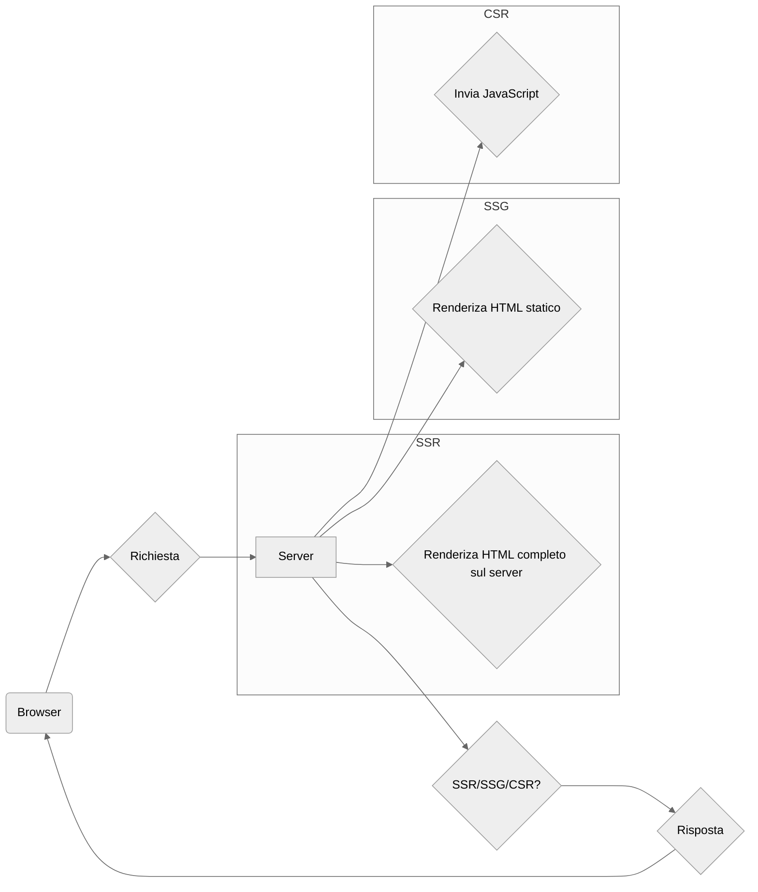
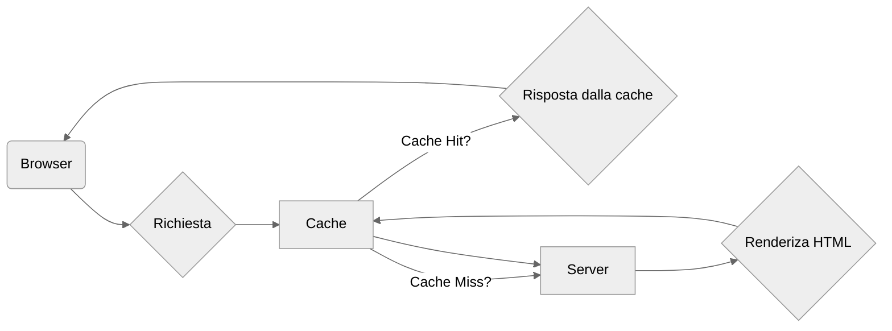
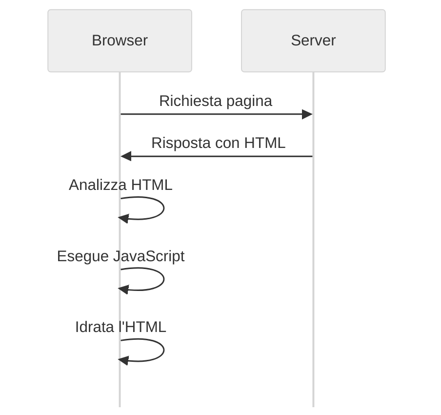

# Descrizione delle tecnologie

## Nuxt

Nuxt è un framework per la realizzazione di applicazioni web basato su Vue.js, avviato come progetto Open source da Alexandre Chopin e Pooya Parsa nel 2016, e continua ad essere mantenuto su Github da un team di sviluppatori che accettano contributi, all'indirizzo [github.com/nuxt/nuxt](https://github.com/nuxt/nuxt).

Nuxt si propone di risolvere i problemi di performance, di ottimizzazione e di accessibilità che sono stati mostrati nel [capitolo 1](#ritorno-al-server-side-rendering) ed anche di fornire un ambiente di sviluppo flessibile, per facilitare la scalabilità e la manutenibilità del codice.

Durante la fase di progettazione, diversi tipi di applicazione suggeriscono diverse esigenze, e Nuxt si dimostra versatile a partire dalle modalità di rendering che offre.

### Modalità di rendering

In questo contesto con rendering di una pagina web non si intende il processo di disegno dei pixel sullo schermo, di cui generalmente si occuperà il browser web, delegando al sistema operativo la gestione dell'hardware. Qui con rendering si intende il processo di generazione del codice HTML, CSS e Javascript che costituisce la pagina web, e che viene inviato al client per essere visualizzato.

#### Client Side Rendering

Nuxt supporta la stessa modalità di rendering discussa nel [capitolo 1](#vue.js), in cui il codice Javascript viene eseguito sul client, cioè nel browser, e la pagina viene generata dinamicamente in base alle richieste dell'utente.

#### Static Site Generation
md -> html

#### Server Side Rendering

#### Server Side Rendering con Hydration

islands

### Convenzioni di progetto

Lo slogan di Nuxt è "The Intuitive Vue Framework", che è in accordo con il suo obiettivo di semplificare la creazione di applicazioni web fornendo un'infrastruttura preconfigurata e pronta all'uso. In questo modo Nuxt permette di concentrarsi sulla logica dell'applicazione, piuttosto che sulla configurazione del progetto. In questo è ricalcata la filosofia di David Heinemeier Hansson, l'ideatore del framework Ruby on Rails, che ha coniato il termine "convention over configuration"[^convention-over-configuration].

[^convention-over-configuration]: [Wikipedia - Convention over configuration](https://en.wikipedia.org/wiki/Convention_over_configuration)

### Server Nitro

### Modalità di sviluppo

### Modello di sviluppo

Nel particolare la repository è strutturata secondo il modello di *monorepo*, quindi include pacchetti funzionanti in maniera disaccoppiata, ma che sono usati tutti in maniera coesa all'interno del sistema Nuxt.

- `packages/nuxt` è il core del framework.
- `packages/nuxi` è lo strumento da linea di comando per la creazione di nuovi progetti, ora spostato su [github.com/nuxt/cli](github.com/nuxt/cli).
- `packages/schema` contiene le definizioni dei tipi di dati utilizzati.
- `packages/kit` è un toolkit per la creazione di moduli aggiuntivi.
- `packages/test-utils` contiene degli script per il testing di unità.
- `packages/vite` è una fork di Vite, un bundler per gli script di frontend, usato di default da Nuxt.
- `packages/webpack` è una fork di Webpack, un'altro bundler per gli script di frontend che si può scegliere in alternativa a Vite.
- `docs` è la documentazione ufficiale, scritta sotto forma di sito web staico, usando Nuxt stesso.

I contributi sono proposti su Github e l'iter consigliato varia in base al tipo di modifica:

- Per proporre un **Bugfix** si apre un *issue*[^github-issue] per discutere il problema, e poi si apre una *pull request* che risolva l'issue.

- Per proporre una **Nuova funzionalità** si apre una *discussion*, e poi di aprire una *pull request* che implementi la funzionalità.

[^github-issue]: Si tratta di un thread aggiunto alla sezione "Issues", che funziona come un forum specifico per ogni progetto, accessibile a tutti gli utenti registrati di Github.

I contributi poi vengono sottoposti a test automatici prima di essere passati ad una revisione da parte del team di sviluppo, in modo da conformare lo stile del codice, della documentazione ed anche del messaggio di commit. Le etichette fornite nelle *PR* più comunemente sono: `enhancement`, `nice-to-have`, `bug`, `discussion`, `documentation`, `performance` e `refactor`.

Al Novembre 2024, sono stati aperti circa 15'000 issues, sono stati avanzati circa 7'000 commi da più di 700 contributori. I progetti Open source su Github che usano Nuxt sono circa 350'000 e questi numeri sono in costante crescita.

Oltre a modificare la monorepo, gli sviluppatori Open source sono invitati a creare **moduli** per estendere le Nuxt con funzionalità non essenziali, ma idonee per l'interoperabilità con altri software. Questi moduli possono essere pubblicati su Npm come pacchetti, con `@nuxt/kit` come dipendenza, ed al Dicembre 2024 se ne contano più di 200[^moduli-nuxt].

Nel [capitolo 3](#soluzioni-di-design) si illustrerà un modulo che permette di usare Nuxt in combinazione con Typeorm.

[^moduli-nuxt]: [Moduli supportati ufficialmente da Nuxt](https://nuxt.com/modules)

## Typeorm

