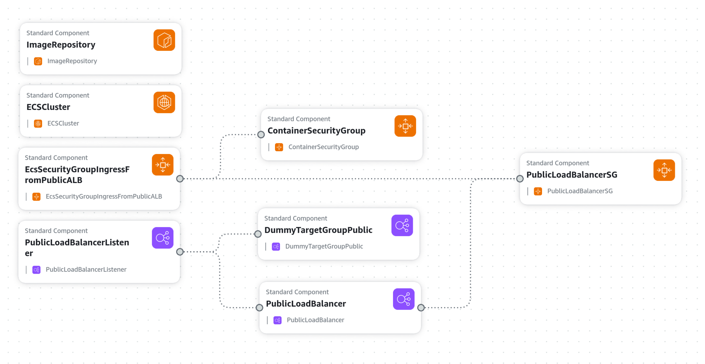
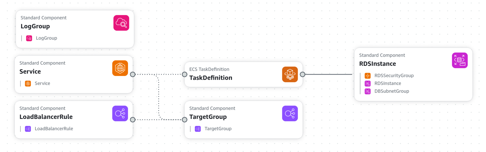
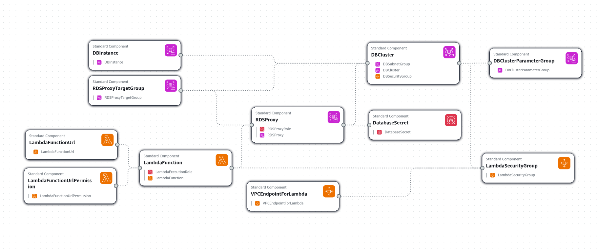
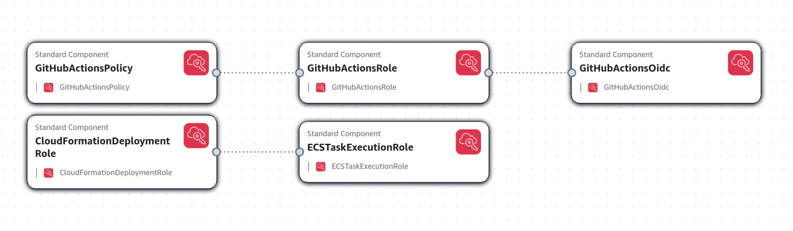
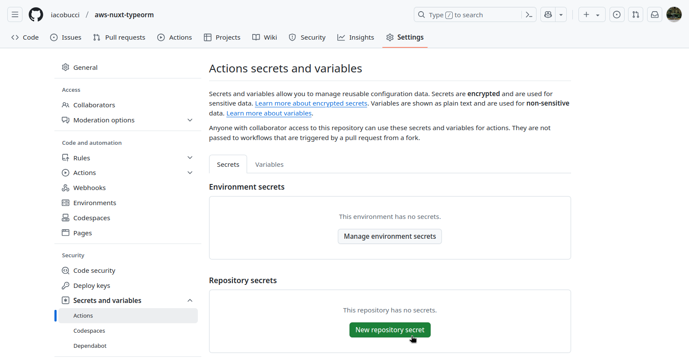

# Soluzioni di design

Vengono esposte delle soluzioni progettuali ed implementative per la realizzazione di un'applicazione web con le tecnologie dettagliate nel capitolo precedente, Nuxt e TypeORM, in combinazione con i servizi cloud AWS, che ho approfondito durante il tirocinio curriculare presso l'azienda Soluzioni Futura s.r.l., ora Polarity s.r.l.

Il progetto realizzato per questo lavoro di tesi include:

-   Progettazione delle infrastrutture cloud mediante codice _Cloudformation_, secondo il modello a container e serverless.
-   Progettazione, per entrambe le infrastrutture, di script di integrazione continua con _Github Actions_.
-   Progettazione, per entrambe le infrastrutture, di sistemi di integrazione di TypeORM con Nuxt.
-   Deploy e test di performance di applicazioni di esempio con Nuxt e TypeORM, su entrambe le infrastrutture.

## Architettura del cloud e integrazione continua

Amazon web services è una piattaforma che offre una _PaaS_, platform as a service, dove sono messi a disposizione servizi di calcolo, di storage e di database; ma anche una _IaaS_, infrastructure as a service, che permette di configurare reti di calcolatori virtuali accessibili via internet.

Per iniziare ad utilizzare AWS è necessario registrarsi (come root user dell'account) accedendo alla dashboard online ([https://aws.amazon.com/it/console/](https://aws.amazon.com/it/console/)).

### Progettazione dell'infrastruttura dei servizi cloud AWS

Parte del progetto è stata l'avviamento dell'infrastruttura AWS per mezzo di codice di marcatura `yaml` con Cloudformation, un servizio che permette di gestire risorse in AWS in modo dichiarativo. Cloudformation permette di creare stack di risorse con files di template che definiscono le risorse 

```yaml
Description: "Deploy a database with provided username and password"
Parameters:
    DBUsername:
        Type: String
        Description: Database master username
    DBPassword:
        Type: String
        Description: Database master password
        NoEcho: true

Resources:
  RDSInstance:
    Type: AWS::RDS::DBInstance
    Properties:
      MasterUsername: !Ref "DBUsername"
      MasterUserPassword: !Ref "DBPassword"

Outputs: 
  RDSAddress:
    Description: "Address of the RDS instance"
    Value: !GetAtt RDSInstance.Endpoint.Address
```

-
-
-

Di seguito sono esposte due architetture con risorse essenziali, e che potranno essere personalizzate per soddisfare le esigenze di una qualsiasi applicazione e del suo team di sviluppo modificando i template Cloudformation forniti nelle directory `cloudformation/` delle repositories.

Le due architetture sono ospitate dalla Vpc di default di AWS, che dispone di tre subnet pubbliche collegate ad un Internet Gateway. Questo permette di accedere ai servizi HTTP esposti dagli stack Cloudformation da internet.

Entrambe le architetture espongono servizi HTTP, ma non forniscono un DNS personalizzato. Per aggiungere un DNS personalizzato, è possibile utilizzare il servizio Route 53 di AWS.

#### Architettura basata su container

a partire da [^aws-template]

[^aws-template]: [AWS CloudFormation Starter Workflow for GitHub Actions](https://github.com/aws-samples/aws-cloudformation-starter-workflow-for-github-actions)

> {width=90%}

> {width=90%}

#### Architettura serverless

Con serverless si intende un'architettura che non richiede agli sviluppatori di gestire l'infrastruttura sottostante, ma si basa su servizi cloud che non necessitano configurazioni di rete[^serverless].

[^serverless]: [Serverless architectures](https://martinfowler.com/articles/serverless.html) - Articolo di Mike Roberts sul blog di Martin Fowler.

> {width=90%}

### Continuous Integration e Continuous Deployment con Github Actions

Il team di sviluppo dovrà solamente configurare la propria repository per l'integrazione continua, aggiungendo l'ID dell'account AWS che intendono utilizzare e le credenziali del database, che potranno essere usate per connettersi al database in fase di debug.

Nelle repository ho realizzato

Connessione della repository ad un _role_ AWS con permessi limitati mediante OpenID Connect.

è presente anche uno script di setup che permette di creare dei roles

> {width=90%}

> {width=70%}

Nel caso dell'architettura basata su container, il workflow di Github Actions si occuperà di fare:

1. Checkout del codice sorgente
1. Login ad AWS
1. Deploy dello stack `infrastructure.yml` con Cloudformation
1. Login al registry ECR creato dallo stack
1. Build, tag e push dell'immagine Docker su ECR
1. Deploy dello stack `service.yml` con Cloudformation
1. Stampa dell'url del servizio e del database

Nel caso dell'architettura serverless, il workflow di Github Actions si occuperà di fare:

1. Checkout del codice sorgente
1. Login ad AWS
1. Creazione, se non esiste, di un Bucket S3 per il salvataggio del codice della Lambda
1. Installazione delle dipendenze
1. Build del progetto
1. Creazione di un file zip con il `.output` della build
1. Caricamento del file zip su S3
1. Deploy dello stack Cloudformation
1. Stampa dell'url del servizio e del database

Una prima metrica di performance delle soluzioni architetturali è il tempo di completamento del workflow che le implementa. Questo può essere monitorato nella dashboard "Actions" della repository.

I dati che ho rilevato, per il progetto di esempio completo e funzionante di Nuxt e TypeORM, sono i seguenti:

| Architettura | Tempo di creazione | Tempo di aggiornamento |
| :----------: | :----------------: | :--------------------: |
|  Container   |      14m 58s       |         5m 30s         |
|  Serverless  |       6m 30s       |           1m           |

## Un'applicazione di esempio con Nuxt e TypeORM

Nelle repositories

### Design patterns per il riutilizzo del modello dei dati

### Implementazione di TypeORM in Nuxt

lifecycles di Nuxt

Le task di ECS si comportano come server stateful, in quanto dopo l'avvio tendono a rimanere attivi fino alla loro terminazione manuale. Anche in caso di guasti, il servizio ECS si riavvia automaticamente e la continuità del servizio è garantita in quanto TypeORM si collegherà nuovamente al database.

L'istanza di DataSource è esportata per essere utilizzata in altri moduli del progetto, come una funzione asincrona `initialize()`

```typescript
const options =
	process.env.NODE_ENV === "production"
		? {
				type: "postgres",
				host: process.env.DB_HOSTNAME,
				database: process.env.DB_NAME,
				port: parseInt(process.env.DB_PORT || "5432"),
				username: process.env.DB_USERNAME,
				password: process.env.DB_PASSWORD,
				ssl: { rejectUnauthorized: false },
				synchronize: false,
				logging: true,
				entities, // array di classi delle entità
				migrations: [],
				subscribers: [],
		  }
		: {
				type: "sqlite",
				database: ":memory:",
				synchronize: true,
				logging: true,
				entities,
				migrations: [],
				subscribers: [],
		  };

export const AppDataSource = new DataSource(options);

export async function initialize() {
	try {
		if (!AppDataSource.isInitialized) {
			await AppDataSource.initialize();
			console.log("Typeorm inizializzato", {
				type: AppDataSource.options.type,
				database: AppDataSource.options.database,
			});
		}
	} catch (error) {
		console.error("Errore inizializzazione Typeorm", error);
		throw error;
	}
}
```

Un **plugin** in `~/server/plugins/typeorm.ts`:

```typescript
import { AppDataSource, initialize } from "~/server/utils/datasource";

export default defineNitroPlugin(async () => {
	initialize();
});
```

Per servizi stateless l'approccio è diverso: ad ogni richiesta ad api bisogna assicurarsi che la connessione al database sia attiva. Non basterebbe inizializzare la connessione all'avvio della funzione Lambda, per via delle sue

attendere la connessione. Con pool di connessioni si può fare in modo che queste siano riutilizzate.

## Analisi di performance e sicurezza

### SSR su server distribuiti con ECS ed RDS

#### Test di carico

#### Audit di rendimento lato client

### SSR su CDN statica con funzioni Lambda e Aurora

#### Test di carico

soffre di cold start

#### Audit di rendimento lato client

### Query Active record e Query Builder
