# Soluzioni di design

Vengono esposte delle soluzioni progettuali ed implementative per la realizzazione di un'applicazione web con le tecnologie dettagliate nel capitolo precedente, Nuxt e TypeORM, in combinazione con i servizi cloud AWS, che ho approfondito durante il tirocinio curriculare presso l'azienda Soluzioni Futura s.r.l., ora Polarity s.r.l.

Il progetto realizzato per questo lavoro di tesi include:

-   Progettazione delle infrastrutture cloud mediante codice _Cloudformation_, secondo il modello a container e serverless, e di script di integrazione continua con _Github Actions_.
-   Progettazione, per entrambe le infrastrutture, di sistemi di integrazione di TypeORM con Nuxt.
-   Deploy e test di performance di applicazioni di esempio con Nuxt e TypeORM, su entrambe le infrastrutture.

## Architettura del cloud e integrazione continua

Amazon web services è una piattaforma che offre una _PaaS_, platform as a service, dove sono messi a disposizione servizi di calcolo, di storage e di database; ma anche una _IaaS_, infrastructure as a service, che permette di configurare reti di calcolatori virtuali accessibili via internet.

Per iniziare ad utilizzare AWS è necessario registrarsi (come root user dell'account) accedendo alla dashboard online ([https://aws.amazon.com/it/console/](https://aws.amazon.com/it/console)).

### Progettazione dell'infrastruttura dei servizi cloud AWS

Parte del progetto è stata l'avviamento dell'infrastruttura AWS per mezzo di codice di marcatura `yaml` con Cloudformation, un servizio che permette di gestire risorse in AWS in modo dichiarativo. Cloudformation permette di creare interi stack nei quali si possono creare e collegare servizi AWS.

Un esempio concettuale di template Cloudformation `yaml`, dove vengono presi in input username e password, poi si avviano due risorse: un server linux virtuale EC2 e un'istanza di database RDS che viene configurata con i parametri in ingresso tramite `!Ref`. L'istanza EC2 verrà creata solo dopo che l'istanza RDS sarà stata avviata, per via della direttiva `!GetAtt "RDSInstance.Endpoint.Address"`, così il suo accesso al database sarà garantito. Infine viene esposto l'indirizzo IP pubblico dell'istanza EC2.

```yaml
Description: "Deploy a database with provided username and password"
Parameters:
    DBUsername:
        Type: String
        Description: Database master username
    DBPassword:
        Type: String
        Description: Database master password
        NoEcho: true

Resources:
    RDSInstance:
        Type: AWS::RDS::DBInstance
        Properties:
            MasterUsername: !Ref "DBUsername"
            MasterUserPassword: !Ref "DBPassword"

    EC2Instance:
        Type: AWS::EC2::Instance
        Properties:
            Environment:
                Variables:
                    DB_HOSTNAME: !GetAtt "RDSInstance.Endpoint.Address"
                    DB_USERNAME: !Ref "DBUsername"
                    DB_PASSWORD: !Ref "DBPassword"

Outputs:
    EC2Address:
        Description: "Public IP address of the EC2 instance"
        Value: !GetAtt "EC2Instance.PublicIp"
```

Uno stack Cloudformation si può trovare in vari stati, mostrati nel diagramma:

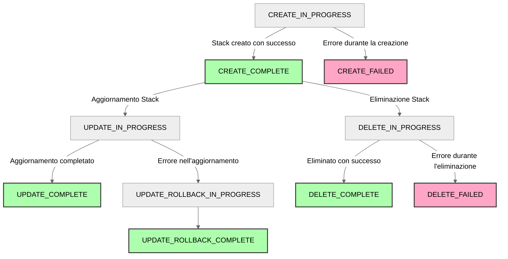

Di seguito sono esposte due architetture diverse ed essenziali, in quanto forniscono una base di partenza funzionante e che può essere personalizzata per soddisfare le esigenze di una qualsiasi applicazione e del suo team di sviluppo modificando i rispettivi template Cloudformation.

Le due architetture sono ospitate dalla _Vpc_ (Virtual Private Cloud, un modo per isolare le risorse dei vari utenti di AWS) di default, che dispone di tre subnet pubbliche collegate ad un Internet Gateway. Entrambe le architetture espongono servizi HTTP, ma non forniscono un DNS personalizzato, che si potrebbe aggiungere con il servizio Route 53 di AWS.

#### Architettura basata su containers

L'architettura basata su container AWS Elastic Cloud Service (ECS) è una soluzione che permette di gestire container Docker che eseguono una certa applicazione in un cluster di macchine virtuali EC2. Questa architettura è simile a quella di un'applicazione monolitica:

-   ECS richiede minore configurazione di server singoli. I container sono immagini autocontenute che possono essere avviate senza preparare l'ambiente a mano o mediante script. Si può aggiornare l'immagine del container senza dover riavviare l'intera macchina virtuale.
-   La scalabilità è più semplice, in quanto si può configurare il numero di container in base al carico di lavoro. Ogni container è associato ad una task, e queste si comportano in maniera idempotente. È facile impostare un bilanciamento del carico tra le task.
-   I prezzi sono fissi in base alle risorse che si utilizzano. Se si sceglie di avere del bilanciamento aggiuntivo mediante _autoscaling_ si pagherà per le risorse utilizzate, ma bisogna considerare dei costi di base per tenere in esecuzione almeno un container.
-   Nonostante l'autoscaling, il modello di server è di tipo **stateful**, in quanto i container rimangono attivi per un tempo indefinito.

Sono stati scritti due stack:

`infarstructure.yml`, che include:

e `service.yml`, che include:

> 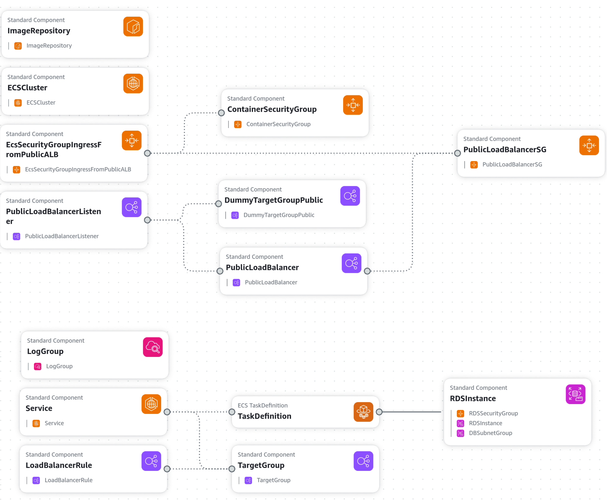{width=90%}
> Diagramma dell'architettura basata su containers: sopra lo stack `infrastructure.yml`, sotto `service.yml`

La repository con il template relativo all'architettura basata su containers realizzato per il progetto di tesi è ospitata su Github all'indirizzo [github.com/iacobucci/cfn-nuxt-typeorm-ecs-rds](https://github.com/iacobucci/cfn-nuxt-typeorm-ecs-rds).

#### Architettura serverless

La seconda architettura proposta, basata su funzioni AWS Lambda, è una soluzione serverless. Con serverless si intende[^serverless] l'esecuzione di codice in container di calcolo senza stato, avviati tramite eventi, effimeri (potrebbero essere eliminati dopo una sola invocazione), e completamente gestiti dal provider cloud. Questo modello è adatto per applicazioni che richiedono scalabilità automatica e che non necessitano di server attivi per lunghi periodi di tempo. Le funzioni Lambda hanno le seguenti caratteristiche:

[^serverless]: Citando la definizione "2" in [Serverless architectures](https://martinfowler.com/articles/serverless.html) - articolo di Mike Roberts sul blog di Martin Fowler.

-   La configurazione di una Lambda è minima: basta caricare un archivio `zip` del codice da eseguire e specificare un runtime tra i supportati (Node.js, Python, Java, ecc.).
-   La scalabilità è la migliore possibile: il provider cloud si occupa di avviare nuove istanze di Lambda in base al carico di lavoro.
-   I costi sono basati sul tempo di esecuzione e sulle risorse utilizzate. Se il codice non viene eseguito, non si pagherà nulla.
-   Il modello di server è di tipo **stateless**, in quanto le funzioni Lambda non mantengono lo stato tra le invocazioni. Questo significa che non si può mantenere una connessione attiva al database.
-   Il limite di esecuzione di una Lambda è di 15 minuti. Se il codice richiede più tempo, si dovrà spezzare la funzione in più Lambda.
-   Soffrono del problema del _cold start_: la prima invocazione di una funzione Lambda può richiedere più tempo rispetto alle successive, in quanto il provider cloud deve avviare un container di calcolo e caricare il codice della funzione. Le invocazioni successive saranno più veloci, in quanto il container sarà riutilizzato, seppure per breve tempo.

È stato configurato lo stack `serverless.yml`, che include:

> 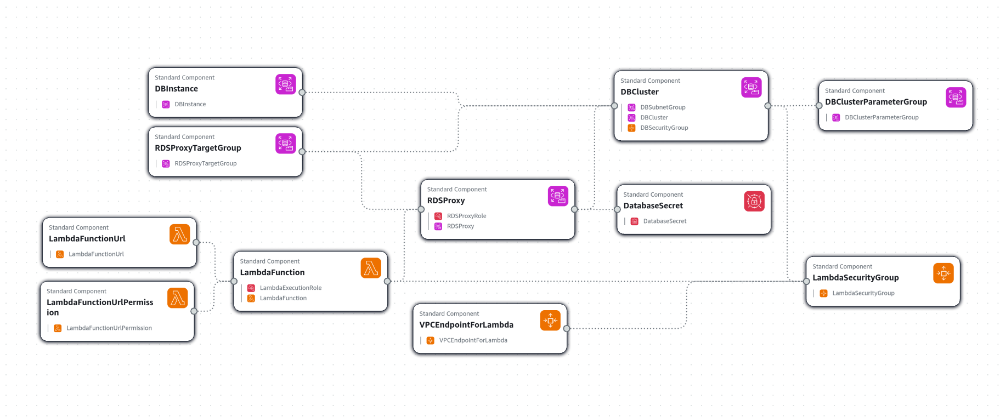{width=90%}
> Diagramma dell'architettura basata su funzioni serverless: lo stack `serverless.yml`

La repository con il template relativo all'architettura basata su funzioni serverless realizzato per il progetto di tesi è ospitata su Github all'indirizzo [github.com/iacobucci/cfn-nuxt-typeorm-lambda-aurora](https://github.com/iacobucci/cfn-nuxt-typeorm-lambda-aurora).

### Continuous Integration e Continuous Deployment con Github Actions

Per iniziare a pubblicare la loro applicazione, il team di sviluppo potrà clonare nell'account della propria organizzazione uno dei due _template Github_ linkati sopra, poi iniziare a configurare l'account AWS per la connessione alla repository. Per non passare dalla dashboard di AWS, è suggerito un procedimento che richiede:

1. L'installazione della CLI di AWS da un ambiente di linea di comando POSIX-compatibile con Python 3.6 o superiore installato:

```bash
pip3 install --user awscli
```

Ed il login dalla CLI al proprio account AWS con la procedura guidata:

```bash
aws configure
```

2. L'avvio di un deploy Cloudformation, da eseguire una sola volta, che creerà un ruolo _IAM_ con permessi limitati alle operazioni normalmente eseguite dall'integrazione continua ed anche un'identità federata OpenID Connect per limitare quelle operazioni alla sola repository Github in questione.

```bash
export GIHTUB_ORG=iacobucci
export REPOSITORY_NAME=aws-nuxt-typeorm
aws cloudformation deploy \
	--stack-name github-actions-cloudformation-deploy-setup \
	--template-file cloudformation/setup.yml \
	--capabilities CAPABILITY_NAMED_IAM \
	--region eu-central-1 \
	--parameter-overrides GitHubOrg=$GITHUB_ORG RepositoryName=$REPOSITORY_NAME
```

3. Configurare la propria repository per l'integrazione continua, aggiungendo:

-   `AWS_ACCOUNT_ID`: l'ID dell'account AWS che intendono utilizzare.
-   `DB_NAME`: il nome principale del database.
-   `DB_PORT`: la porta TCP usata durante le comunicazioni con il database.
-   `DB_USERNAME`: l'username principale del database.
-   `DB_PASSWORD`: la password dell'username principale.

nei _Secrets_ di Github, come mostrato in figura. I Secrets sono variabili che non vengono esposte nel codice sorgente, ed una volta aggiunte non possono essere visualizzate nuovamente.

> {width=70%}
> Impostazione dei secrets in una repository GitHub

4. Iniziare a scrivere codice su branch di sviluppo.

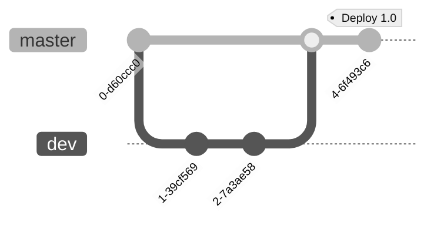

Ad un push su `master` inizierà il workflow di Github Actions, che si occuperà di:

-   Nel caso dell'architettura basata su container:

1.  Checkout del codice sorgente.
1.  Login ad AWS.
1.  Deploy dello stack `infrastructure.yml` con Cloudformation.
1.  Login al registry ECR creato dallo stack.
1.  Build, tag e push dell'immagine Docker su ECR. Qui saranno disponibili le varie versioni di produzione dell'applicazione.
1.  Deploy dello stack `service.yml` con Cloudformation.
1.  Stampa dell'url del servizio e del database.

-   Nel caso dell'architettura serverless:

1.  Checkout del codice sorgente.
1.  Login ad AWS.
1.  Creazione, se non esiste, di un Bucket S3 con versionamento per il salvataggio del codice della Lambda. Saranno disponibili anche qui le varie versioni di produzione dell'applicazione.
1.  Installazione delle dipendenze.
1.  Build del progetto.
1.  Creazione di un file zip con il `.output` della build.
1.  Caricamento del file zip su S3.
1.  Deploy dello stack Cloudformation.
1.  Stampa dell'url del servizio e del database.

In questo modo il team di sviluppo potrà concentrarsi sullo sviluppo del codice, mentre l'integrazione continua si occuperà di fare deploy dell'applicazione in produzione.

Una prima metrica di performance di queste soluzioni architetturali è il tempo di completamento del workflow che le implementa. Questo può essere monitorato nella dashboard "Actions" della repository.

I dati che ho rilevato, per il progetto di esempio completo e di Nuxt e TypeORM, sono i seguenti:

| Architettura | Tempo di creazione | Tempo di aggiornamento |
| :----------: | :----------------: | :--------------------: |
|  Container   |      14m 58s       |         6m 35s         |
|  Serverless  |      14m 41s       |         1m 20s         |

Diagramma waterfall

## Un'applicazione di esempio con Nuxt e TypeORM

È stata realizzata una semplice applicazione di esempio, che fa uso di query TypeORM con i vari pattern descritti, con il modello di dominio dell'esempio [relazioni molti a molti](#relazioni-molti-a-molti). Si è usata questa applicazione di social networking con:

-   `/users/[page]`: pagina principale con lista di utenti, che può essere scorsa con degli appositi pulsanti.
-   `/user/[username]`: pagina di dettaglio di un utente, con lista dei post scritti.
-   `/post/[id]`: pagina di dettaglio di un post, con il contenuto e lista degli utenti che hanno messo "mi piace".

Infine, per testare query più complesse, è stata aggiunta una pagina:

-   `/users/whoLikedPostsByAuthors`: pagina che mostra gli utenti che hanno messo "mi piace" ai post di una lista di autori. Query di questo tipo potrebbero essere utili per un eventuale sistema di raccomandazione di post.

### Implementazione di TypeORM in Nuxt

Per implementare TypeORM è utile osservare il ciclo di vita di una richiesta HTTP in Nuxt:

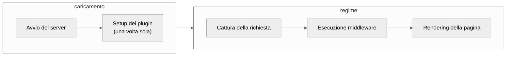

Per il motivo che le task di ECS si comportano come server stateful, in quanto dopo l'avvio tendono a rimanere attive fino alla loro terminazione manuale, si può impostare il collegamento al database in un _plugin_. Nuxt Anche in caso di guasti, il servizio ECS si riavvia automaticamente e la continuità del servizio è molto probabile in quanto rimarranno attive altre task, e quella guasta verrà sostituita.

L'istanza di DataSource è esportata da un file Typescript in `~/server/utils` per essere utilizzata in altri moduli del progetto, come una funzione asincrona `initialize()`

```typescript
const options =
	process.env.NODE_ENV === "production"
		? {
				type: "postgres",
				host: process.env.DB_HOSTNAME,
				database: process.env.DB_NAME,
				port: parseInt(process.env.DB_PORT || "5432"),
				username: process.env.DB_USERNAME,
				password: process.env.DB_PASSWORD,
				ssl: { rejectUnauthorized: false },
				synchronize: false,
				logging: true,
				entities, // array di classi delle entità da collegare
		  }
		: {
				type: "sqlite",
				database: ":memory:",
				synchronize: true,
				logging: true,
				entities,
		  };

export const AppDataSource = new DataSource(options);

export async function initialize() {
	try {
		if (!AppDataSource.isInitialized) {
			await AppDataSource.initialize();
			console.log("Typeorm inizializzato", {
				type: AppDataSource.options.type,
				database: AppDataSource.options.database,
			});
		}
	} catch (error) {
		console.error("Errore inizializzazione Typeorm", error);
		throw error;
	}
}
```

Il plugin in `~/server/plugins/typeorm.ts` ne fa uso:

```typescript
import { AppDataSource, initialize } from "~/server/utils/datasource";

export default defineNitroPlugin(async () => {
	initialize();
});
```

Per servizi stateless invece l'approccio è diverso: ad ogni richiesta bisogna assicurarsi che la connessione al database sia attiva. Non basterebbe inizializzare la connessione all'avvio della funzione Lambda, per via delle limitazioni di tempo di esecuzione. Si può fare in modo che la connessione sia riutilizzata, ma non si deve sovraccaricare il database con troppe connessioni aperte. Per questo motivo si può fare uso della Proxy di RDS, che permette di creare un pool di connessioni al database e di riutilizzarle.

### Pattern implementativi

## Analisi di performance e sicurezza

Per valutare la riuscita dell'implementazione delle tecnologie scelte, sono stati effettuati dei test

### Audit di rendimento lato client

La pagina principale fa due redirect: uno da `/` a `/users` fino a `/users/1`, per mostrare la prima pagina di tutti gli utenti.

Analisi di Google Lighthouse

caso ecs

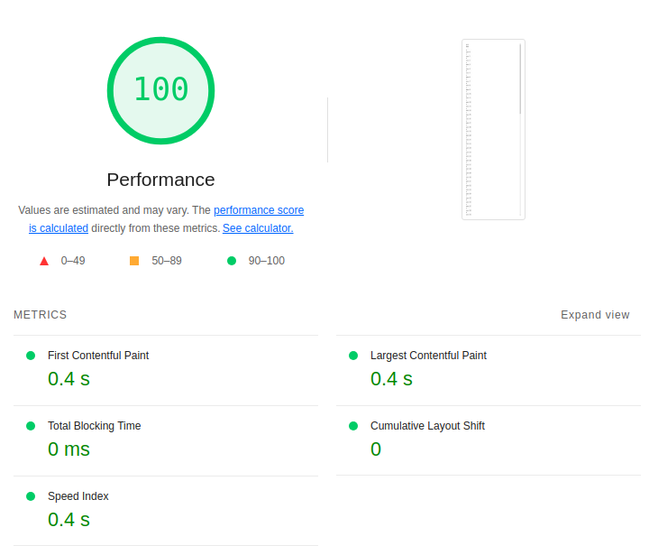{width=40%}

caso lambda

> 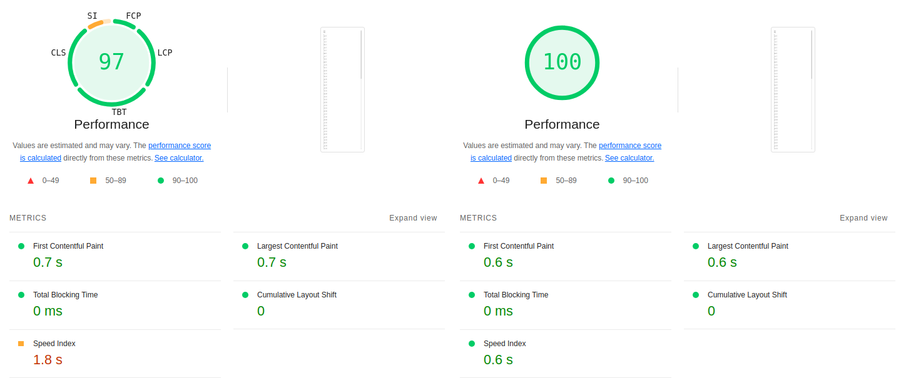{width=60%}
> Performance del SSR per l'architettura Lambda. A sinistra in caso di _cold start_, a destra in caso di _heated start_.

### Test di stress per Active record e Query Builder

Sono stati inseriti dei dati di esempio, che includono:

-   10000 utenti.
-   100000 post.
-   1000000 "mi piace" ai post.

Per ogni configurazione sono stati effettuati dei test di stress con lo strumento `hey`[^hey], che ha eseguito 200 richieste HTTP con 50 thread contemporanei agli endpoint:

[^hey]: [github.com/rakyll/hey](https://github.com/rakyll/hey) - il repository di hey su Github.

-   `/users/whoLikedPostsByAuthorsQueryBuilder`, che esegue la query numero 5 descritta in [Query Builder](#query-builder)
-   `/users/whoLikedPostsByAuthorsActiveRecord`, che esegue la query numero 5 descritta in [Active Record](#active-record)

con parametri: `?authors=user-1,...,user-10`, quindi scegliendo 10 autori di post.

I risultati, in termini di quante risposte sono state ricevute dopo un certo tempo, sono stati raccolti in un grafico a barre con distanze temporali omogenee per ogni test. Le risposte sono state sempre conformi alle attese, e non sono state riscontrate anomalie, riscontrando un 100% di status code "200".

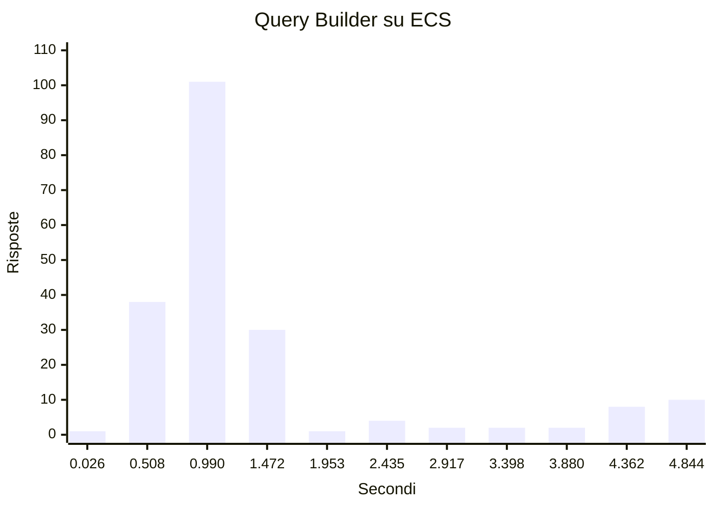

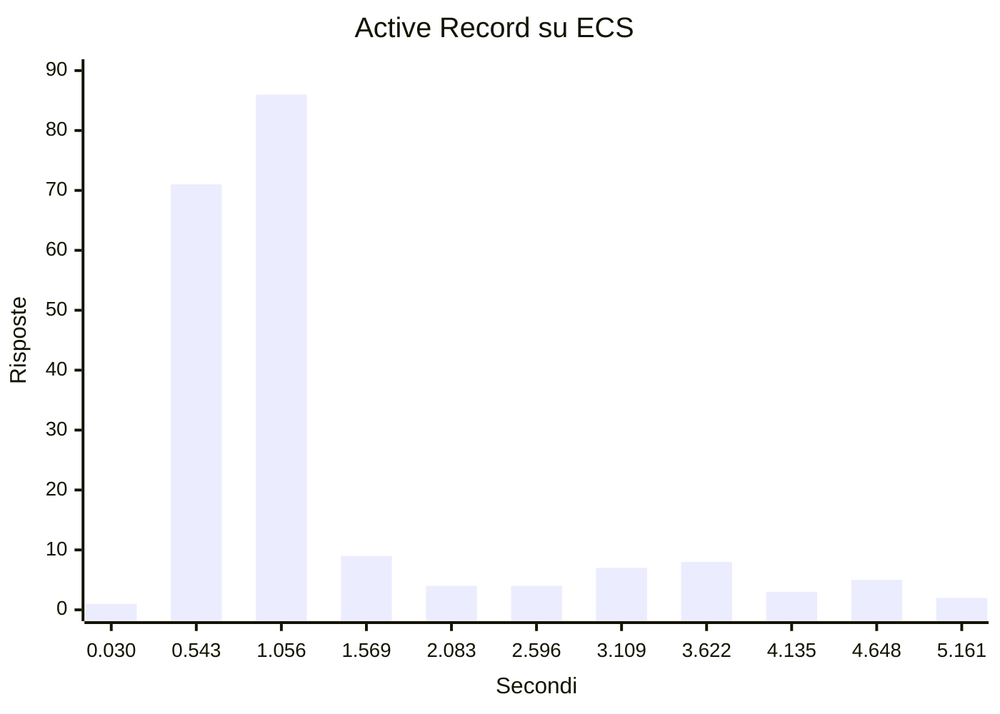

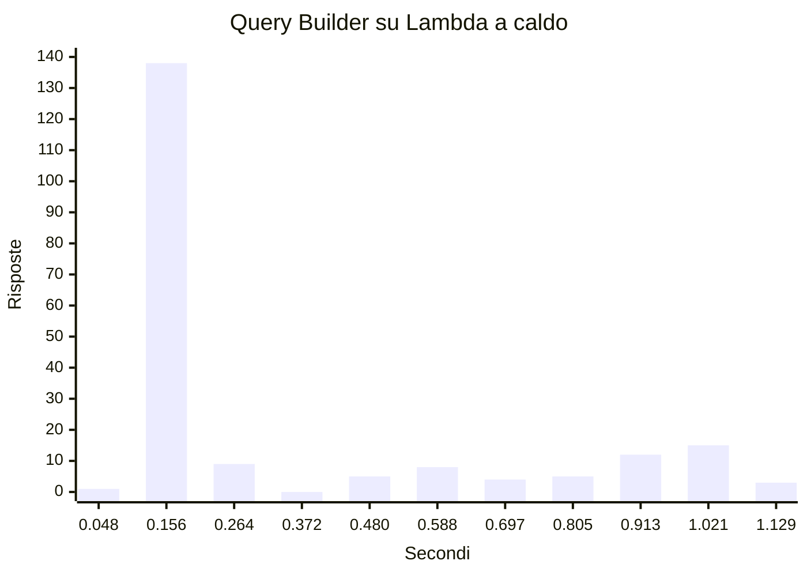

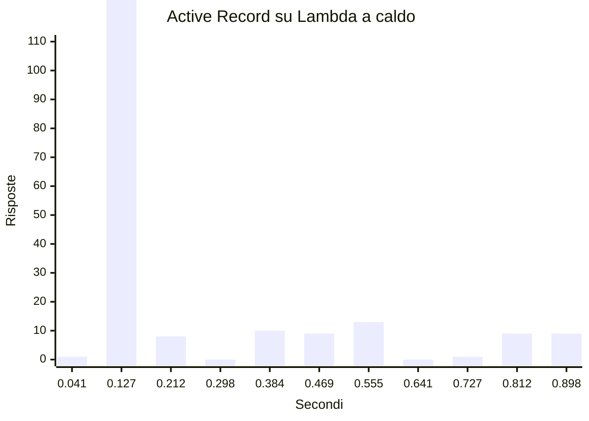

Esaminando il codice SQL generato

```SQL
SELECT "User"."id" AS "User_id", "User"."username" AS "User_username", "User__User_posts"."id" AS "User__User_posts_id", "User__User_posts"."content" AS "User__User_posts_content", "User__User_posts"."authorId" AS "User__User_posts_authorId", "User__User_posts__User__User_posts_likedBy"."id" AS "User__User_posts__User__User_posts_likedBy_id", "User__User_posts__User__User_posts_likedBy"."username" AS "User__User_posts__User__User_posts_likedBy_username" FROM "user" "User" LEFT JOIN "post" "User__User_posts" ON "User__User_posts"."authorId"="User"."id"  LEFT JOIN "post_liked_by_user" "User__User_posts_User__User_posts__User__User_posts_likedBy" ON "User__User_posts_User__User_posts__User__User_posts_likedBy"."postId"="User__User_posts"."id" LEFT JOIN "user" "User__User_posts__User__User_posts_likedBy" ON "User__User_posts__User__User_posts_likedBy"."id"="User__User_posts_User__User_posts__User__User_posts_likedBy"."userId" WHERE (((("User"."username" IN ($1, $2, $3)))))
```

```SQL
SELECT DISTINCT "user"."id" AS "user_id", "user"."username" AS "user_username" FROM "user" "user" INNER JOIN "post_liked_by_user" "likedPost_user" ON "likedPost_user"."userId"="user"."id" INNER JOIN "post" "likedPost" ON "likedPost"."id"="likedPost_user"."postId"  INNER JOIN "user" "author" ON "author"."id"="likedPost"."authorId" WHERE "author"."username" IN ($1, $2, $3)
```

Si tratta in entrambi i casi di query con 3 JOIN. La versione generata dalla `find()` fa uso di più _alias_, ma non è necessariamente più lenta ad eseguire sul database.

Questi risultati si spiegano per via dell'uso efficiente del pattern Active Record con le API Repository. Entrambe le query fanno una sola `await`

### Test di sicurezza e vulnerabilità

Sono stati effettuati test con `sqlmap`[^sqlmap], uno strumento di test di sicurezza automatizzati per database SQL. Con i test effettuati, tra cui:

-   "AND boolean-based blind - WHERE or HAVING clause",
-   "Boolean-based blind - Parameter replace (original value)",
-   "Union query (NULL) - 1 to 10 columns",

[^sqlmap]: [sqlmap.org](https://sqlmap.org/) - il sito ufficiale di sqlmap.

## Conclusioni e possibili estensioni
