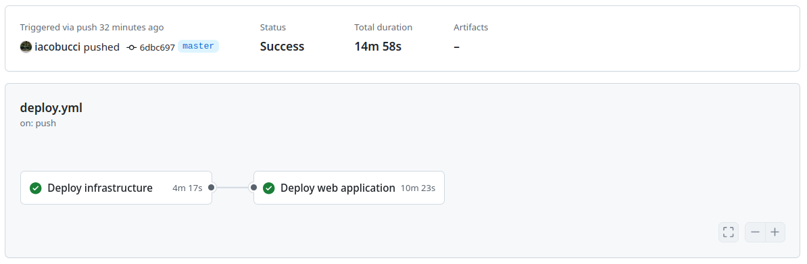
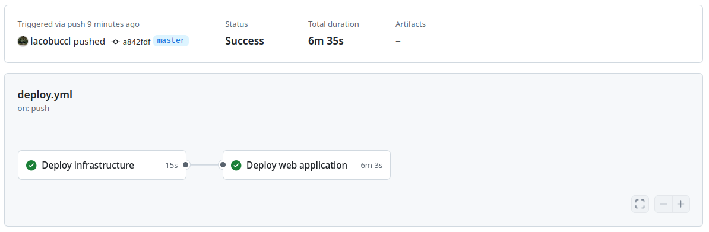

# Soluzioni di design

## Architettura del cloud e integrazione continua

AWS scelto per la sua flessibilità e scalabilità, e per continuazione di tirocinio

### Infrastruttura dei servizi cloud AWS

cloudformation


> {width=90%}

> {width=90%}

> {width=90%}

### Continuous Integration e Continuous Deployment con Github Actions

github actions

> {width=70%}

tempi di provisioning

> {width=70%}

> {width=70%}

## Un'applicazione di esempio con Nuxt e TypeORM

utilizzo di componenti shadcn

### Implementazione di un plugin per TypeORM

scelte di progetto

### Design patterns per il riutilizzo del modello dei dati

### Sviluppo in type-safety

LSP

-   typescript
-   vue-language server

ZOD e TRPC

[^serverless]: [Serverless architectures](https://martinfowler.com/articles/serverless.html) - Articolo di Mike Roberts sul blog di Martin Fowler che descrive

## Analisi di performance e sicurezza

### Deploy dell'applicazione SSR su server distribuiti con ECS ed RDS

scala orizzontale, aggiunta di nodi

### Deploy dell'applicazione SSG su CDN statica con funzioni Lambda e Aurora

scala verticale, parallelismo

### Analisi di performance 


In questo capitolo si illustrano alcune soluzioni di design per la realizzazione di applicazioni web con Nuxt in combinazione con TypeORM.

```html
<script setup lang="ts">
	import { User } from "~/entities/User";

	definePageMeta({
		prerender: true, // la pagina è pre-renderizzata nel 
	});

	// query diretta nel lato ssr
	const { data: users } = await useAsyncData(
		"users",
		async () => {
			// questa chiamata a useAsyncData non è risolvibile a build time
			console.log("Server side only");
			try {
				let users = await User.find(); // undefined
				// le funzioni di active record per typeorm sono tree-shaked e non vengono incluse nel bundle
				return users;
			} catch (error) {
				console.error(error);
			}
			return [];
		},
		{
			// Impedisce la ri-esecuzione lato client
			server: true,
		}
	);
</script>

<template>
	<div>
		<li v-for="user in users">{{ user.fullName() }}</li>
	</div>
</template>
```
