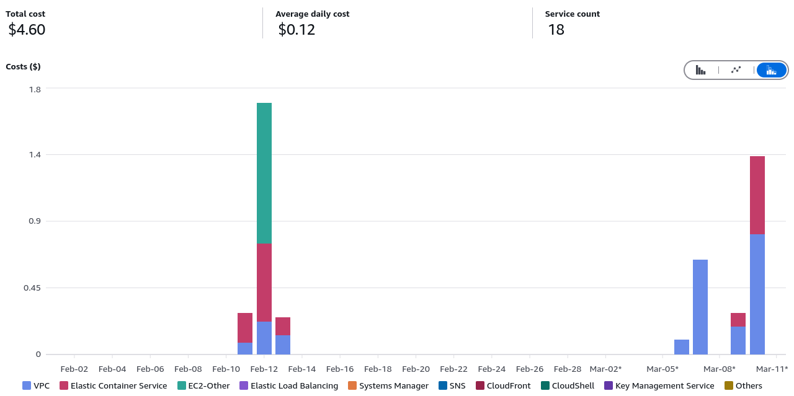

# Conclusioni {.unnumbered}

L'obiettivo del lavoro di tesi è stato quello di presentare delle soluzioni implementative ed architetturali per Applicazioni Web, declinabili in progetti di vario genere, da semplici blog statici a complessi sistemi di gestione dati. L'efficacia di queste soluzioni, che sono state proposte come continuazioni naturali delle linee evolutive dello sviluppo Web, è stata argomentata dopo aver effettuato test di performance e di sicurezza su applicazioni di esempio.

Le tecnologie descritte sono il framework Nuxt, che permette di creare applicazioni orientate a componenti Vue.js anche implementando Server Side Rendering, poi la libreria TypeORM, che fornisce astrazioni per la gestione di database relazionali in TypeScript. É stata dettagliata anche l'infrastruttura cloud AWS, sulla quale ho lavorato durante il Tirocinio Curriculare, che permette di scalare le risorse in base alle necessità.

Dalle analisi effettuate si possono trarre le seguenti conclusioni:

Il server side rendering di **Nuxt** è efficace per ottenere ottimi risultati di Largest Contentful Paint, Search Engine Optimization, oltre che per impostare un progetto ben strutturato ed estendibile. Con il supporto nativo a Typescript e la possibilità di creare componenti riutilizzabili, Nuxt fornisce un ambiente di sviluppo completo di convenzioni utili a coordinare lo sviluppo di codice collaborativo.

Nonostante che React sia la libreria di componenti reattivi Javascript più diffusa e documentata, Vue.js rimane un'alternativa molto apprezzata per la sua espressività e per la sua curva di apprendimento più dolce, e Nuxt è il framework di punta per questa tecnologia.

Per quello che riguarda **TypeORM**, Active Record si è dimostrato un pattern valido, sia per sintassi che per performance, se usato con accortezze che includono un uso limitato e possibilmente parallelo di `await` per evitare di bloccare il server ed il caricamento di entità correlate solo quando necessario, per evitare di sovraccaricare la memoria.

In risposta ai movimenti NoSQL, che predicano un'assoluta flessibilità dello schema e del modello dei dati, si può dire che i database relazionali sono ancora una scelta valida per progetti che richiedono una struttura ben definita. Questi, in combinazione con la tipizzazione statica di linguaggi come Typescript consentono ai programmatori di evitare problemi di runtime, catturando errori di sintassi e di tipo già in fase di compilazione, prima ancora che di test. In base a confronti tra coerenza, disponibilità e partizionabilità[^cap], una soluzione che aggancia TypeORM ad un'istanza PostgreSQL in cloud risulta essere una scelta che bilancia bene questi tre aspetti, privilegiando i primi due.

[^cap]: [CAP theorem](https://en.wikipedia.org/wiki/CAP_theorem) - Wikipedia.

Gli esperimenti effettuati sul deploy degli applicativi Nuxt-based con **AWS**, hanno mostrato come le architetture serverless, dotate di pool di connessioni a database, forniscono performance comparabili ed in certi casi migliori rispetto a server dedicati, ad un costo di gestione inferiore.

Durante i test effettuati, comprendenti circa 10000 richieste HTTP(s) equamente ripartite tra ECS e Lambda, sono stati rilevati i costi mostrati nel seguente grafico:

> {width=80%}

Tenuti fissi i costi relativi alla VPC (ammontati a $2.17), e tralasciati i costi dei database RDS e delle imposte, il costo di ECS è stato di $1.47. Il costo di Lambda, approssimato per eccesso è risultato pari a $0.01.

Queste considerazioni però non si possono estendere a tutti i casi d'uso e ad ogni scala. A riguardo, si può citare un articolo di Marcin Kolny[^lambda-to-ecs] che ha descritto la migrazione di alcuni sistemi di analisi dati di Amazon Prime Video da un sistema serverless a uno basato su ECS, che ha consentito di ridurre i costi del 90% e di aumentare le performance. L'overhead aggiunto dalle troppe funzioni Lambda avviate a cascata (sia in dovuto al cold start che al _marshalling_ di dati verso altri microservizi) è stato il fattore determinante di questa scelta.

[^lambda-to-ecs]: [Scaling up the Prime Video audio/video monitoring service and reducing costs by 90%](https://web.archive.org/web/20240717095641/www.primevideotech.com/video-streaming/scaling-up-the-prime-video-audio-video-monitoring-service-and-reducing-costs-by-90) - versione archiviata dell'articolo originale.

Nonostante questo, AWS Lambda rimane il servizio di esecuzione di codice in cloud che crea il compromesso più competitivo in termini di costo e performance per progetti su scala media e piccola, e rimane un'ottima piattaforma per servire applicazioni Nuxt con API che si interfacciano a database relazionali distribuiti mediante TypeORM. La repository sulla quale sono stati eseguiti i test, disponibile su [github.com/iacobucci/cfn-nuxt-typeorm-lambda-aurora](https://github.com/iacobucci/cfn-nuxt-typeorm-lambda-aurora), può fare da punto di partenza per ulteriori esperimenti e sviluppi.

Possibili estensioni di questo lavoro vanno in direzioni di:

-   Ampliamento dell'infrastruttura cloud delle applicazioni di esempio per includere altri servizi AWS, come S3 per il salvataggio e reperimento di file statici, assieme a CloudFront per la loro distribuzione.
-   Utilizzo mirato di strategie di rendering diverse in Nuxt, anche reso possibile servizi AWS aggiuntivi. Un'estensione interessante che si potrebbe apportare al framework stesso potrebbe riguardare finalizzazioni dell'implementazione delle "server functions", come descritte nel paragrafo [Endpoint API](#endpoint-api).
-   Implementazione di un sistema di cache in memory per le query TypeORM più frequenti, come Redis. Una miglioria che si potrebbe apportare alla libreria stessa potrebbe essere l'estensione dell'API `find()` anche alle colonne di tipo `json` o `jsonb` di database relazionali che le supportano, come PostgreSQL, per ottenere i benefici di una struttura rigida e ben definita assieme alla flessibilità di sistemi di persistenza orientati a documenti.
