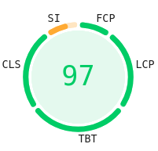

<!-- _backgroundColor: #224466 -->
<!-- _color: white -->
<!-- _paginate: false -->
<!-- _paginate: skip -->

<script src="../node_modules/mermaid/dist/mermaid.min.js"></script>
<script>mermaid.initialize({startOnLoad:true, theme:"neutral", mirrorActors:false});</script>

<link rel="stylesheet" href="res/styles.css">
<link rel="stylesheet" href="../node_modules/@fortawesome/fontawesome-free/css/all.css">

<h1 style="padding-bottom:0; margin-bottom:0">Sviluppo e Analisi delle Prestazioni</h1>
<h1 style="padding-top:0; margin-top: 0">di Applicazioni Web Nuxt-based in Cloud AWS</h1>

Tesi di laurea in: Tecnologie Web T
Relatore: Chiar.mo Prof. Paolo Bellavista
Candidato: Valerio Iacobucci

---

## Obiettivi

### Allestimento di un ambiente di sviluppo mirato a

-   Uso dei componenti come unità di codice riutilizzabile con **Nuxt**
-   Utilizzo di linguaggi e pattern type-safe con **TypeORM**
-   Separazione delle preoccupazioni tra programmazione dell'app e mantenimento dell'infrastruttura con **AWS**

### Ottimizzazione del rendimento

-   Sicurezza di tipo e da attacchi informatici
-   Metriche di SEO, FCP/LCP, CLS
-   Performance per end-user

---

# Nuxt

Framework per Applicazioni Web full-stack basato su Vue.js e Nitro

<div class="container">
<div class="content">

```txt
assets/
components/
composables/
layouts/
pages/

server/
	api/
	functions/
	plugins/

test/
app.vue
nuxt.config.ts
package.json
```

</div>
<div class="content">
<div class="mermaid" style="width: 60%">
%%{init: {'theme': 'neutral', 'mirrorActors': false} }%%
flowchart TB
subgraph vue[**View**]
direction LR
vueview[**View**]
vueviewmodel[**ViewModel**]
vuemodel[**Model**]
vueview <--> vueviewmodel
vueviewmodel --> vuemodel
vuemodel -.-> vueviewmodel
end
model[**Model** ]
controller[**Controller**]
controller -- Accesso CRUD --> model
model -.-> controller
vue -- Richiesta utente --> controller
controller -.-> vue
</div>
</div>
</div>

---

<!-- prettier-ignore-start -->
```typescript
export default defineEventHandler(async event => {
	const body = await readBody<UsersByLastName>(event);
	const lastName = body.lastName;
	const users = await User.find({ where: { lastName } });
	return { status: 200, body: { users } }
});
```

```html
<script setup lang="ts">
	const usersByLastName = reactive<UsersByLastName>({ lastName: "" });
	const { data, pending, error } = await useFetch("/api/users/byLastName", {
		method: "POST", body: usersByLastName, watch: [usersByLastName], lazy: true,
	});
</script>
<template>
	<input v-model="usersByLastName.lastName" />
	<li v-for="user in data.users">
		<NuxtLink to="/user/{{ user.username }}" >
			<RowsUser :username="user.username" />
		</NuxtLink>
	</li>
</template>
```
<!-- prettier-ignore-end -->

---

<h2 style="translate: 0px -30px">Modalità di rendering</h2>

<div class="container">
<div class="horizontal">

<div class="content">
<div style="translate:-50px -110px">
Client Side Rendering
</div>

<div class="mermaid" style="width: 70%; padding-right: 60px">
%%{init: {'theme': 'neutral', 'mirrorActors': false} }%%
sequenceDiagram
participant client as Client
participant frontend as CDN
participant backend as Server API
client->>frontend: Richiesta pagina
frontend-->>client: DOM minimo
frontend-->>client: Bundle Javascript
client->>client: Esecuzione dell'app Vue
client->>backend: Richieste dati o assets
backend-->>client: Dati JSON o binari
client->>client: Aggiornamento della pagina
</div>
</div>

<div class="content">
<div style="translate:50px -110px">
Server Side Rendering
</div>

<div class="mermaid" style="width: 60%; padding-left: 60px">
%%{init: {'theme': 'neutral', 'mirrorActors': false} }%%
sequenceDiagram
participant client as Client
participant frontend as Server Frontend
participant backend as Server API
client->>frontend: Richiesta pagina
frontend->>backend: Richieste dati
backend-->>frontend: Dati JSON
frontend->>frontend: Rendering HTML completo
frontend-->>client: HTML completo + JS bundle
client->>client: Hydration (interattività)
client->>backend: Richieste dati o assets
backend-->>client: Dati JSON, binari
client->>frontend: Cambiamento della pagina
frontend-->>client: Chunk di componenti
client->>client: Aggiornamento della pagina
</div>
</div>
</div>
</div>

<div style="translate: 0px 40px">
Nuxt supporta anche altre modalità di rendering, come SSG e ISG, e queste possono essere combinate per ottenere una soluzione ibrida
</div>

---

# TypeORM

-   Supporta diversi adattatori per DBMS: SQLite, Sql.js, MySQL, PostgreSQL, MongoDB...
-   Dispone di una CLI che supporta migrazioni e generazione di entità
-   Le entità sono definite tramite classi Typescript. I tipi delle colonne sono inferiti dal tipo di variabile e si possono dettagliare con decoratori
-   Si possono definire relazioni `@ManyToOne`, `@OneToMany`, `@ManyToMany` e `@OneToOne`. A queste si associano delle colonne o tabelle di join con `@JoinTable` e `@JoinColumn`

---

## Query Builder e Active Record

Permettono di effettuare query CRUD con transazioni ACID

<div class="horizontal" style="scale: 1.82; margin:100px">

<!-- prettier-ignore-start -->
```typescript
// CREATE
await User.createQueryBuilder()
	.insert()
	.into(User)
	.values({ username: "bob" })
	.execute();

// READ
const usersWhoLikedAuthorsPosts = await User
	.createQueryBuilder("user")
	.innerJoin("user.likedPosts", "likedPost")
	.innerJoin("likedPost.author", "author")
	.where("author.username IN (:...usernames)", {
		usernames: ["alice", "bob"],
	})
	.distinct(true)
	.getMany();
```

<div style="min-width:10px"></div>

```typescript
// CREATE
const newUser = new User();
newUser.username = "bob";
await newUser.save();

// READ
const authors = await User.find({
	where: [{ username: In("alice", "bob") }],
	relations: { posts: { likedBy: true } },
});

const usersWhoLikedAuthorsPostsWithDuplicates =
	authors.flatMap((author) =>
	author.posts.flatMap((post) => post.likedBy)
);

const usersWhoLikedAuthorsPosts = [
	...new Set(usersWhoLikedAuthorsPostsWithDuplicates),
];
```
<!-- prettier-ignore-end -->

</div>

---

# AWS

Piattaforma cloud che offre servizi internet (tra cui calcolo, storage, database...) studiata durante il Tirocinio Curriculare ed usata per _Infrastucture as Code_

<div style="max-height: 500px; scale: 0.8; translate: 0 -20px">

<!-- prettier-ignore-start -->
```yaml
Parameters:
    DBUsername:
        Type: String
    DBPassword:
        Type: String
        Description: Database master password

Resources:
    RDSInstance:
        Type: AWS::RDS::DBInstance
        Properties:
            MasterUsername: !Ref "DBUsername"
            MasterUserPassword: !Ref "DBPassword"

    ApplicationInstance:
        Type: ...
        Properties:
            Environment:
                Variables:
                    DB_HOSTNAME: !GetAtt "RDSInstance.Endpoint.Address"
                    DB_USERNAME: !Ref "DBUsername"
                    DB_PASSWORD: !Ref "DBPassword"
```
<!-- prettier-ignore-end -->

</div>

---

<div class="container">
<div class="content">

## Architettura basata su container orchestrati

-   **Elastic Container Service** deploy di container Docker: sempre attivi, quindi costi fissi, scalabilità verticale
-   Servizio **stateful**
-   Database RDS, connessioni persistenti
-   0.25vCPU, 512MB RAM, 2 task attive

</div>

<div class="content">

## Architettura serverless

-   **Lambda** per l'esecuzione di funzioni serverless: costi "pay-as-you-go" e scalabilità orizzontale, ma soffrono di _cold start_
-   Servizio **stateless**
-   Database Aurora con proxy per _pool_ di connessioni
-   256MB RAM, 0 Provisioned Concurrency

</div>
</div>

Entrambe in configurazione base

---

# Integrazione continua

Ospitando la repository su Github, è possibile automatizzare il deploy su AWS con **Actions**: ad un push su `master` si attiva il workflow di CI/CD

<div class="container">
<div class="content">
<div class="mermaid" style="width: 30%">
%%{init: {'theme': 'neutral' , 'gitGraph': {'mainBranchName': 'master'} } }%%
gitGraph
commit
branch dev
checkout dev
commit
commit
checkout master
merge dev
commit tag:"Deploy 1.0"
</div>
</div>
</div>

---

# Applicazioni di esempio

Realizzate semplici applicazioni che simulano un social network con 10'000 utenti, 100'000 post e 1'000'000 di reazioni

-   `/users/[page]`: lista di utenti paginata
-   `/user/[username]`: profilo utente
-   `/post/[id]`: post con reazioni
-   `/users/whoLikedPostsByAuthors?authors=[...]`: per test di query complesse

<div class="container">
<div class="content" style="color:#0969DA">
<div class="container">
<i class="fa-solid fa-link" style="padding-right:25px"></i>
<div>
github.com/iacobucci/cfn-nuxt-typeorm-ecs-rds
</div>
</div>
</div>
<div class="content" style="color:#0969DA">
<div class="container">
<i class="fa-solid fa-link" style="padding-right:25px"></i>
<div>
github.com/iacobucci/cfn-nuxt-typeorm-lambda-aurora
</div>
</div>
</div>

---

## Analisi delle prestazioni

<style>
  table {
    margin: auto;
    text-align: center;
    border-collapse: collapse;
  }
  th, td {
    padding: 10px;
    border: 1px solid black;
  }
</style>
<table>
  <tr>
    <th>Metrica</th>
    <th>ECS</th>
    <th>Lambda a freddo</th>
    <th>Lambda a caldo</th>
  </tr>
  <tr>
    <td>Audit Lighthouse</td>
    <td></td>
    <td></td>
    <td></td>
  </tr>
  <tr>
    <td>FCP / LCP</td>
    <td>0.4s</td>
    <td>0.7s</td>
    <td>0.6s</td>
  </tr>
  <tr>
    <td>Query Builder t/200r<span style="color:gray">*</span></td>
    <td>1.38s</td>
    <td>0.38s</td>
    <td>0.34s</td>
  </tr>
  <tr>
    <td>Active Record t/200r<span style="color:gray">*</span></td>
    <td>1.29s</td>
    <td>1.00s</td>
    <td>0.25s</td>
  </tr>
  <tr>
    <td>Costo esperimenti</td>
    <td>($2.17) + $1.47</td>
    <td colspan="2">($2.17) + $0.01
  </tr>
</table>

---

# Conclusioni

Le tecnologie scelte danno risultati soddisfacenti quando usate in combinazione

-   **Nuxt** è performante e fornisce un ambiente di sviluppo completo
-   **TypeORM** è valido in termini di performance e garantisce sicurezza di tipo
-   **AWS Lambda** è una scelta competitiva in termini di costo e performance per progetti di dimensioni piccole e medie. Su scale molto grandi l'overhead di _cold start_ potrebbe rendere ECS più conveniente<span style="color:gray">\*</span>

Estensioni possibili in direzione di ampliamento dell'infrastruttura cloud per le app d'esempio ed aggiunta di funzionalità alle librerie stesse

<div style="font-size:16pt ; color: gray; text-align:right" href="http://bit.ly/4hMEjhD">*http://bit.ly/4hMEjhD</div>

---

<!-- _backgroundColor: #224466 -->
<!-- _color: white -->
<!-- _paginate: false -->

# Grazie per l'attenzione!
